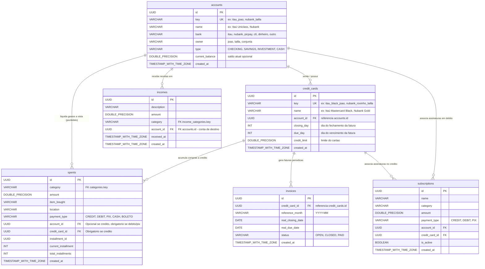
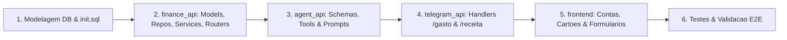

# Plano de Implementação: Arquitetura Natural Conta -> Cartão de Crédito

## 1. Visão Geral e Motivação

Atualmente, o **Flauzino Assistant** utiliza uma entidade genérica e achatada chamada `payment_methods`. Essa modelagem apresenta limitações conceituais e práticas:
1. **Confusão Semântica**:
   - `payment_methods` mistura instrumentos de crédito (`itau_joao`, `nubank_lailla`), meios de liquidação à vista (`pix_joao`, `pix_lailla`) e titulares no próprio identificador (`_joao`, `_lailla`).
2. **Inconsistência nas Receitas**:
   - Receitas (salários, pix recebidos, reembolsos) caem em **Contas Bancárias**, e nunca em "cartões de crédito".
3. **Inconsistência nas Despesas e Faturas**:
   - Despesas a crédito pertencem a um **Cartão de Crédito** que acumula faturas e tem limites e datas de corte/vencimento.
   - Despesas à vista (Pix, débito em conta, dinheiro, TED) saem diretamente de uma **Conta**.
   - O pagamento de uma fatura de cartão deve ser liquidado utilizando o saldo de uma **Conta**.

Como o projeto ainda está em estágio de desenvolvimento ativo (pré-produção), faremos a refatoração profunda (**Opção 1**) para consolidar a hierarquia definitiva:
$$\text{Conta Bancária / Instituição} \longrightarrow \text{Cartão(ões) de Crédito}$$

---

## 2. Nova Arquitetura de Dados (ERD)

---

## 3. Especificação Detalhada por Módulo

### 3.1. `finance_api`

#### 3.1.1. Banco de Dados e Seeds (`infra/db/init.sql`)
1. **Tabela `accounts`**:
   - Campos: `id`, `key` (UNIQUE), `name`, `bank`, `owner`, `type`, `current_balance`, `created_at`.
   - Seeds:
     - `('itau_joao', 'Itaú João', 'itau', 'joao', 'CHECKING')`
     - `('nubank_joao', 'Nubank João', 'nubank', 'joao', 'CHECKING')`
     - `('nubank_lailla', 'Nubank Lailla', 'nubank', 'lailla', 'CHECKING')`
     - `('picpay_joao', 'PicPay João', 'picpay', 'joao', 'CHECKING')`
     - `('c6_joao', 'C6 João', 'c6', 'joao', 'CHECKING')`
     - `('dinheiro_vivo', 'Dinheiro em Espécie', 'outro', 'conjunta', 'CASH')`

2. **Tabela `credit_cards`**:
   - Campos: `id`, `key` (UNIQUE), `name`, `account_id` (FK `accounts.id`), `closing_day`, `due_day`, `credit_limit`, `created_at`.
   - Seeds vinculados às contas criadas:
     - Cartão Itaú João (`closing_day=2`, `due_day=10`)
     - Cartão Nubank João (`closing_day=2`, `due_day=10`)
     - Cartão Nubank Lailla (`closing_day=2`, `due_day=10`)
     - Cartão PicPay João (`closing_day=2`, `due_day=10`)
     - Cartão C6 João (`closing_day=2`, `due_day=10`)

3. **Migração e Atualização de Tabelas Dependentes**:
   - `incomes`: `account_id UUID REFERENCES accounts(id) ON DELETE SET NULL`.
   - `spents`:
     - `payment_type VARCHAR(20) NOT NULL DEFAULT 'CREDIT'`
     - `account_id UUID REFERENCES accounts(id) ON DELETE SET NULL`
     - `credit_card_id UUID REFERENCES credit_cards(id) ON DELETE SET NULL`
   - `invoices`: `credit_card_id UUID REFERENCES credit_cards(id) ON DELETE CASCADE`.
   - Remoção completa da tabela legada `payment_methods`.

#### 3.1.2. Modelos SQLAlchemy
- `finance_api/models/accounts.py`: Modelo `Account`.
- `finance_api/models/credit_cards.py`: Modelo `CreditCard`.
- Atualização em `finance_api/models/incomes.py`, `finance_api/models/spents.py`, `finance_api/models/invoices.py`, `finance_api/models/subscriptions.py`.

#### 3.1.3. Schemas Pydantic
- `finance_api/schemas/accounts.py`:
  - `AccountBase`, `AccountCreate`, `AccountUpdate`, `AccountResponse`.
- `finance_api/schemas/credit_cards.py`:
  - `CreditCardBase`, `CreditCardCreate`, `CreditCardUpdate`, `CreditCardResponse`.
- Atualizações em:
  - `finance_api/schemas/incomes.py`: `account_id: UUID | None`, `account_key: str | None`.
  - `finance_api/schemas/spents.py`: `payment_type: PaymentType`, `account_id: UUID | None`, `credit_card_id: UUID | None`.

#### 3.1.4. Repositórios e Serviços
- `finance_api/repositories/accounts.py`: CRUD de Contas e busca por `key`.
- `finance_api/repositories/credit_cards.py`: CRUD de Cartões e busca por `account_id` ou `key`.
- `finance_api/services/accounts.py`: Regras de negócio de contas.
- `finance_api/services/credit_cards.py`: Validação de dias de corte/vencimento e limite.
- Atualização em `SpentService` e `IncomeService`:
  - Se `payment_type == 'CREDIT'`: valida obrigatoriedade de `credit_card`.
  - Se `payment_type in ('PIX', 'DEBIT', 'CASH', 'BOLETO')`: valida `account`.

#### 3.1.5. Routers e MCP Tools
- `/accounts/`: CRUD de Contas.
- `/credit-cards/`: CRUD de Cartões de Crédito.
- MCP Tools atualizadas:
  - `list_accounts() -> list[dict]`
  - `list_credit_cards() -> list[dict]`
  - `create_income(...)` e `create_spent(...)` com suporte a `account` e `credit_card`.

---

### 3.2. `agent_api`

1. **Enriquecimento do Contexto do LLM**:
   - `FinanceService.get_accounts()` e `FinanceService.get_credit_cards()`.
   - O prompt do agente orienta claramente:
     - **Receitas**: sempre vinculadas a uma `Conta`.
     - **Gastos a Crédito**: vinculados a um `Cartão de Crédito`.
     - **Gastos à Vista (Pix, Débito, Dinheiro)**: vinculados a uma `Conta`.
2. **Ferramentas do Agente**:
   - Atualizar `registrar_gasto` para aceitar `tipo_pagamento` ('credito', 'pix', 'debito', 'dinheiro'), `cartao` e/ou `conta`.
   - Atualizar `registrar_receita` para aceitar `conta_destino`.

---

### 3.3. `telegram_api`

1. **Fluxo `/receita`**:
   - No passo de conta de recebimento: exibe botões inline exclusivamente com as **Contas Bancárias** (Itaú João, Nubank Lailla, etc.).
2. **Fluxo `/gasto`**:
   - Novo subpasso inteligente:
     - Pergunta o Meio: `[💳 Cartão de Crédito]` ou `[⚡ Pix / Débito / Dinheiro]`.
     - Se Crédito: exibe botões inline com os **Cartões de Crédito**.
     - Se Pix/Débito: exibe botões inline com as **Contas**.
3. **Novos Comandos de Consulta**:
   - `/contas`: exibe contas cadastradas e saldos.
   - `/cartoes`: exibe cartões, limites e dias de fechamento/vencimento.

---

### 3.4. `frontend`

1. **Menu e Rotas**:
   - Substituição de `/payment-methods` por:
     - `/accounts` (**Contas Bancárias**): Cards com saldo, banco, titular e lista de cartões associados.
     - `/credit-cards` (**Cartões de Crédito**): Gestão de cartões, dias de corte/vencimento e limites.
2. **Formulários**:
   - `IncomesPage`: select amigável de **Conta de Destino**.
   - `SpentsPage`: toggle entre `Cartão de Crédito` (seleciona cartão) e `À Vista / Pix` (seleciona conta).
3. **Dashboard**:
   - Gráfico de despesas por Cartão vs Contas.

---

## 4. Fases de Execução

- **Fase 1**: Refatoração do `init.sql` e criação de seeds limpos para `accounts` e `credit_cards`.
- **Fase 2**: Implementação em `finance_api` (CRUDs, routers, serviços, validações e MCP tools) e testes unitários.
- **Fase 3**: Implementação em `agent_api` (integração HTTP, tools e prompt contextualizado) e testes unitários.
- **Fase 4**: Implementação em `telegram_api` (fluxos guiados com separação de Contas vs Cartões) e testes unitários.
- **Fase 5**: Implementação em `frontend` (páginas `/accounts` e `/credit-cards`, modais de despesa e receita) e build Vite.
- **Fase 6**: Execução de toda a suíte de testes (`uv run pytest`), validação dos linters (`make lint`, `make format`) e atualização do walkthrough.

---

## 5. Critérios de Aceite e Garantia de Qualidade

1. **Semântica Real**:
   - Nenhuma receita pode ser associada a um cartão de crédito (apenas a contas bancárias ou dinheiro).
   - Nenhuma despesa de crédito pode ficar sem cartão de crédito com closing_day/due_day.
2. **Cobertura de Testes**:
   - 100% dos testes unitários passando (`uv run pytest`) em todas as 4 aplicações.
   - Testes específicos para validação cruzada entre tipo de pagamento e entidade associada.
3. **Qualidade do Código**:
   - Arquitetura estrita `route -> service -> repository`.
   - Limite de até 3 condicionais por função.
   - `make format` e `make lint` 100% limpos.
