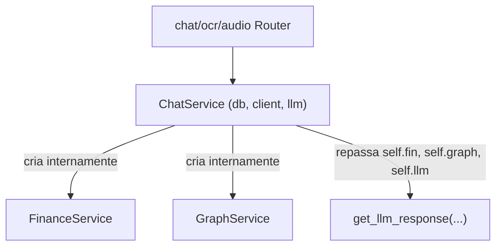
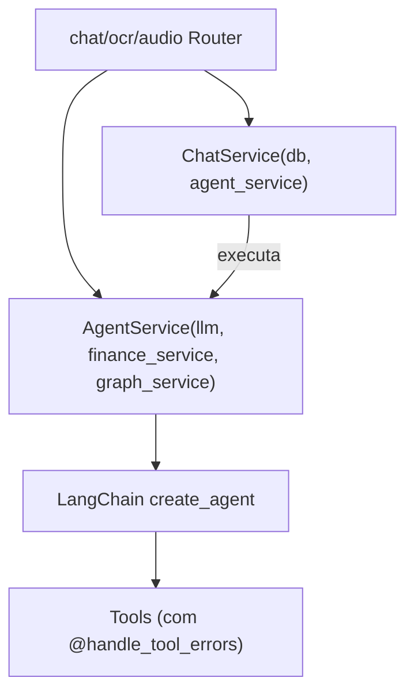

# Especificação Técnica: Refinamento Arquitetural do Agent API

Este documento detalha as melhorias de design, desacoplamento e boas práticas para o `agent_api`, corrigindo problemas de *code smell* (Feature Envy, anti-patterns de tratamento de exceções), ajustando a tipagem estática e padronizando o tratamento de erros em ferramentas do LangChain.

---

## 1. Diagnóstico e Motivação

Durante a revisão de código pós-refatoração do Agentic Tool Calling, identificamos 6 pontos que merecem refinamento estrutural:

| # | Ponto Identificado | Diagnóstico / Problema | Solução Proposta |
|---|--------------------|------------------------|------------------|
| **1** | Anti-pattern no decorator `handle_llm_errors` | `if isinstance(e, (ServiceError, HTTPException)): raise` dentro de `except Exception` é considerado um *code smell* em Python. | Usar cláusula `except (ServiceError, HTTPException): raise` explícita antes do `except Exception`. |
| **2** | Inconsistência de parâmetros nas rotas | Em `audio.py` e `ocr.py`, `ChatService` estava sendo chamado com `ChatService(db, client, llm=llm)` misturando posicionais e keyword. | Padronizar chamadas posicionais: `ChatService(db, client, llm)` ou através de injeção de dependência composta. |
| **3** | *Feature Envy* no `ChatService` | `ChatService` instancia e mantém referências a `finance_service` e `graph_service` unicamente para repassá-las a `get_llm_response`. O serviço de chat não usa essas dependências. | Criar a classe `AgentService` que encapsula `llm`, `finance_service` e `graph_service`. `ChatService` passa a depender apenas do repositório de chat e do `AgentService`. |
| **4** | Gerenciamento de Base64 em `AgentStateWithImage` | Necessidade de documentar e validar formalmente a retenção de Base64 no estado do grafo em vez do schema de saída do LLM. | Manter `AgentStateWithImage` via `Command` para economizar 10k-30k tokens de contexto e impedir corrupção de imagem por alucinação de LLM. |
| **5** | Type check warning no `agent.ainvoke` | Analisador estático (Pyright/Pylance) alerta incompatibilidade entre `dict[str, list[BaseMessage]]` e `InputAgentState`. | Tipar e fazer cast seguro de entrada para satisfazer o contrato do LangGraph sem perder type safety. |
| **6** | Repetição de `try...except` nas Tools | As 4 ferramentas em `tools.py` repetem lógica idêntica de captura de erro de serviço para retornar mensagens textuais ao modelo. | Criar o decorator `@handle_tool_errors` em `agent_api/core/decorators.py` especializado para graceful failure de Tools. |

---

## 2. Arquitetura Proposta

### 2.1 Separação de Responsabilidades (SRP & DIP)

Antes:


Depois:


### 2.2 Benefícios
- **`ChatService` Focado**: Cuida exclusivamente de gerenciamento de sessões, persistência no banco e formatação de respostas da API.
- **`AgentService` Especializado**: Cuida de gerar prompts contextuais, montar tools LangChain e orquestrar a execução do grafo cognitivo.
- **Injeção Transparente**: O FastAPI provê `get_agent_service` que instancia uma única vez as dependências necessárias.

---

## 3. Detalhamento Técnico das Mudanças

### 3.1 Correção de `agent_api/core/decorators.py`
```python
def handle_llm_errors(func: Callable[..., Any]) -> Callable[..., Any]:
    """Decorator to catch LLM errors and raise LLMService implementation errors."""

    @functools.wraps(func)
    async def wrapper(*args: Any, **kwargs: Any) -> Any:
        try:
            return await func(*args, **kwargs)
        except (ServiceError, HTTPException):
            raise
        except OutputParserException as e:
            raise LLMParsingError(f"Failed to parse LLM response: {str(e)}")
        except GoogleAPIError as e:
            raise LLMProviderError(f"Google Gemini Error: {str(e)}")
        except Exception as e:
            logger.error(f"Unexpected LLM error: {e}", exc_info=True)
            raise ServiceError(f"Unexpected LLM Error: {str(e)}")

    return wrapper
```

### 3.2 Novo Decorator: `@handle_tool_errors` em `agent_api/core/decorators.py`
Para garantir que falhas em serviços externos (ex: indisponibilidade temporária da `finance_api` ou `graph_api`) não derrubem a requisição com status 500, o decorator intercepta exceções e converte em retorno textual explicativo para o agente:
```python
def handle_tool_errors(tool_name: str | None = None) -> Callable[..., Any]:
    """Decorator to catch exceptions inside LangChain tools and return graceful error messages."""

    def decorator(func: Callable[..., Any]) -> Callable[..., Any]:
        @functools.wraps(func)
        async def wrapper(*args: Any, **kwargs: Any) -> Any:
            name = tool_name or func.__name__
            try:
                return await func(*args, **kwargs)
            except ServiceError as e:
                logger.error(f"Erro de serviço na tool {name}: {e}")
                return f"Erro na operação de {name}: {e.message if hasattr(e, 'message') else str(e)}"
            except Exception as e:
                logger.error(f"Erro inesperado na tool {name}: {e}", exc_info=True)
                return f"Não foi possível completar a ação em {name} devido a uma instabilidade temporária."

        return wrapper

    return decorator
```

### 3.3 Refatoração das Ferramentas em `agent_api/services/tools.py`
Remoção de blocos repetitivos `try...except`:
```python
@tool
@handle_tool_errors("consultar_saldos")
async def consultar_saldos(categorias: list[str] | None = None) -> str | list[dict]:
    """Consulta os saldos e limites de gastos atuais da família."""
    logger.info(f"Tool consultar_saldos chamada para categorias: {categorias}")
    balances = await finance_service.get_balances(categories=categorias)
    if not balances:
        return "Nenhum limite ou gasto encontrado para as categorias informadas."
    return balances
```

### 3.4 Criação de `AgentService` em `agent_api/services/agent.py`
```python
class AgentService:
    """Encapsulates LangChain agent lifecycle, tool execution and prompt generation."""

    def __init__(
        self,
        llm: BaseChatModel,
        finance_service: FinanceService,
        graph_service: GraphService,
    ):
        self.llm = llm
        self.finance_service = finance_service
        self.graph_service = graph_service
        self.tools = create_agent_tools(finance_service, graph_service)

    async def get_response(
        self,
        chat_history: list[dict[str, Any]],
        platform: str | None = None,
    ) -> AssistantResponse:
        system_prompt = await self._build_system_prompt(platform=platform)

        agent = create_agent(
            model=self.llm,
            tools=self.tools,
            system_prompt=system_prompt,
            response_format=AssistantResponse,
            state_schema=AgentStateWithImage,
        )

        messages: list[BaseMessage] = [
            HumanMessage(content=msg.get("content", ""))
            if msg.get("role") == "user"
            else AIMessage(content=msg.get("content", ""))
            for msg in chat_history
        ]

        agent_input = cast(Any, {"messages": messages})
        result = await agent.ainvoke(agent_input)

        structured_resp: AssistantResponse | None = result.get("structured_response")
        image_base64 = result.get("image_base64")

        if structured_resp is not None:
            if image_base64:
                structured_resp.image_base64 = image_base64
            return structured_resp

        msgs = result.get("messages", [])
        last_msg = msgs[-1] if msgs else None
        response_text = (
            str(last_msg.content)
            if last_msg and last_msg.content
            else "Desculpe, não consegui processar sua mensagem."
        )
        return AssistantResponse(
            response_message=response_text,
            image_base64=image_base64,
            is_complete=False,
        )
```

### 3.5 Refatoração do `ChatService` em `agent_api/services/chat.py`
```python
class ChatService:
    def __init__(
        self,
        db_session: AsyncSession,
        agent_service: AgentService,
    ):
        self.repository = ChatRepository(db_session)
        self.agent_service = agent_service

    @handle_service_errors
    async def process_message(
        self, message: str, session_id_str: str | None, platform: str | None = None
    ) -> ChatResponse:
        session_id = await self._get_or_create_session(session_id_str)
        await self._save_message(session_id, "user", message)
        history_dicts, messages = await self._get_chat_history(session_id)

        response = await self.agent_service.get_response(history_dicts, platform=platform)

        await self._save_message(session_id, "assistant", response.response_message)
        return self._build_response(
            session_id=session_id,
            response_text=response.response_message,
            previous_messages=messages,
            is_complete=response.is_complete,
            suggested_options=response.suggested_options,
            image_base64=response.image_base64,
        )
```

### 3.6 Injeção de Dependências FastAPI (`agent_api/dependencies.py` ou roteadores)
Criar factory simples:
```python
def get_agent_service(
    client: httpx.AsyncClient = Depends(get_http_client),
    llm: BaseChatModel = Depends(get_llm),
) -> AgentService:
    finance_service = FinanceService(client=client)
    graph_service = GraphService(client=client)
    return AgentService(llm, finance_service, graph_service)

def get_chat_service(
    db: AsyncSession = Depends(get_db),
    agent_service: AgentService = Depends(get_agent_service),
) -> ChatService:
    return ChatService(db, agent_service)
```

E os endpoints (`chat.py`, `ocr.py`, `audio.py`) tornam-se extremamente enxutos:
```python
@router.post("/chat", response_model=ChatResponse)
async def chat_endpoint(
    request: ChatRequest,
    service: ChatService = Depends(get_chat_service),
) -> ChatResponse:
    return await service.process_message(request.message, request.session_id, request.platform)
```

---

## 4. Plano de Implementação Passo a Passo

1. **Step 1: Ajuste dos Decorators**
   - Corrigir a hierarquia de `except` em `handle_llm_errors`.
   - Adicionar `@handle_tool_errors`.
2. **Step 2: Criação de `AgentService`**
   - Mover a lógica de orquestração do LangChain de `llm.py` para a classe `AgentService`.
   - Resolver o warning de tipagem em `ainvoke`.
3. **Step 3: Refatoração de `ChatService`**
   - Atualizar `ChatService` para receber apenas `db_session` e `agent_service`.
4. **Step 4: Refatoração dos Routers**
   - Criar dependências `get_agent_service` e `get_chat_service`.
   - Simplificar `chat.py`, `ocr.py` e `audio.py`.
5. **Step 5: Ajuste da Suíte de Testes**
   - Atualizar `test_chat_service.py`, `test_llm_service.py`, `test_tools.py` e testes de routers.
   - Validar 100% de cobertura com `pytest` e formatação com `ruff`.

---

## 5. Critérios de Aceite
- [ ] Nenhum anti-pattern de `if isinstance(e, ...): raise` dentro de `except Exception`.
- [ ] `ChatService` possui responsabilidade única sem conhecer detalhes de `FinanceService` ou `GraphService`.
- [ ] As 4 tools em `tools.py` utilizam o decorator `@handle_tool_errors` sem blocos `try...except` repetidos.
- [ ] Zero warnings de type checker no `agent.ainvoke`.
- [ ] 100% dos testes existentes (150 testes) e novos testes passando com sucesso.
- [ ] Código em conformidade com o linter (`ruff check`) e formatador (`ruff format`).
