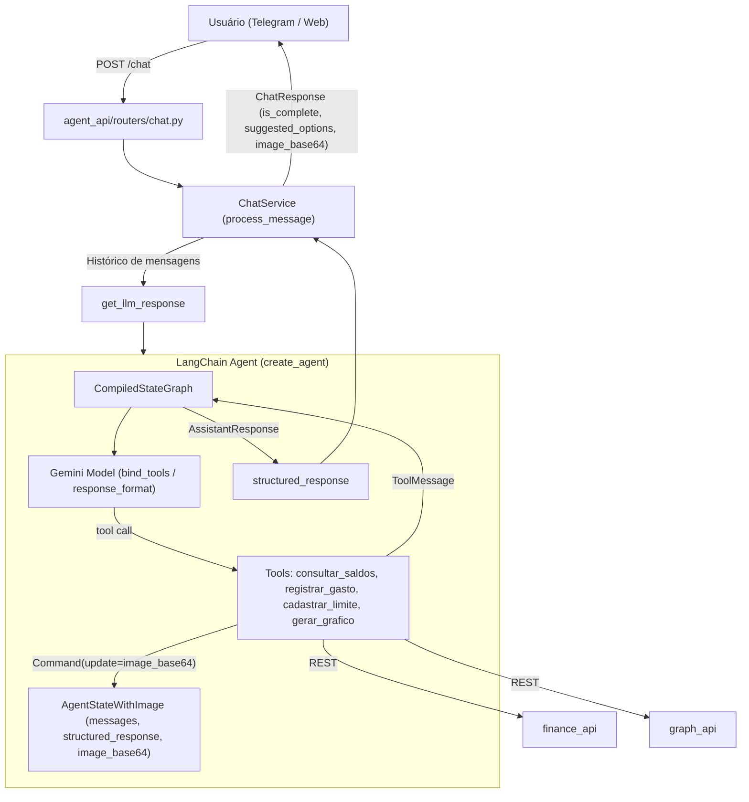

# Plano de Implementação: Refatoração do Agent API para Tool Calling Nativas

Este documento detalha a refatoração para transformar a interação do `ChatService` em `agent_api` em um fluxo baseado em **Agentic Tool Calling** nativo com Google Gemini e LangChain (`create_agent`).
Eliminamos a complexidade de regras condicionais e múltiplas chamadas LLM no `ChatService`, assim como loops manuais imperativos e ferramentas artificiais, permitindo que o modelo decida quando consultar saldos, gerar gráficos, registrar despesas e limites ou responder ao usuário de forma estruturada.

---

## 1. Visão Geral da Arquitetura

---

## 2. Ferramentas (Tools) Implementadas

As ferramentas estão implementadas em `agent_api/services/tools.py` utilizando o decorator `@tool` nativo do LangChain:

1. **`consultar_saldos(categorias: list[str] | None = None) -> list[dict]`**:
   - Consulta o endpoint de saldos e limites na `finance_api` via `FinanceService.get_balances(categories)`.
   - Retorna os dados para que o LLM formule a resposta textual ou decida gerar um gráfico.

2. **`registrar_gasto(categoria: str, valor: float, item_comprado: str, metodo_pagamento: str, local_compra: str) -> str`**:
   - Só deve ser chamada após confirmação explícita do usuário.
   - Chama `FinanceService.save_spent(...)`.

3. **`cadastrar_limite(categoria: str, valor: float) -> str`**:
   - Só deve ser chamada após confirmação explícita do usuário.
   - Chama `FinanceService.save_limit(...)`.

4. **`gerar_grafico(tipo: Literal["bar", "pie"], categorias: list[str] | None = None, modo: Literal["saldo", "gastos"] = "saldo") -> Command`**:
   - Busca os saldos necessários e solicita à `graph_api` via `GraphService.generate_chart(...)`.
   - Utiliza `Command(update={"image_base64": image_b64, "messages": [...]})` para armazenar o binário no estado do grafo sem inchar o contexto do LLM.

---

## 3. Estruturação da Resposta com `response_format`

- O agente utiliza `create_agent(model=..., tools=..., response_format=AssistantResponse, state_schema=AgentStateWithImage)`.
- O próprio LangChain orquestra o ciclo ReAct e gera a resposta no schema `AssistantResponse` de forma nativa (`result["structured_response"]`).
- Não há necessidade de ferramentas terminais falsas (`final_response`) nem de loops imperativos manuais `for _ in range(max_iterations)`.
