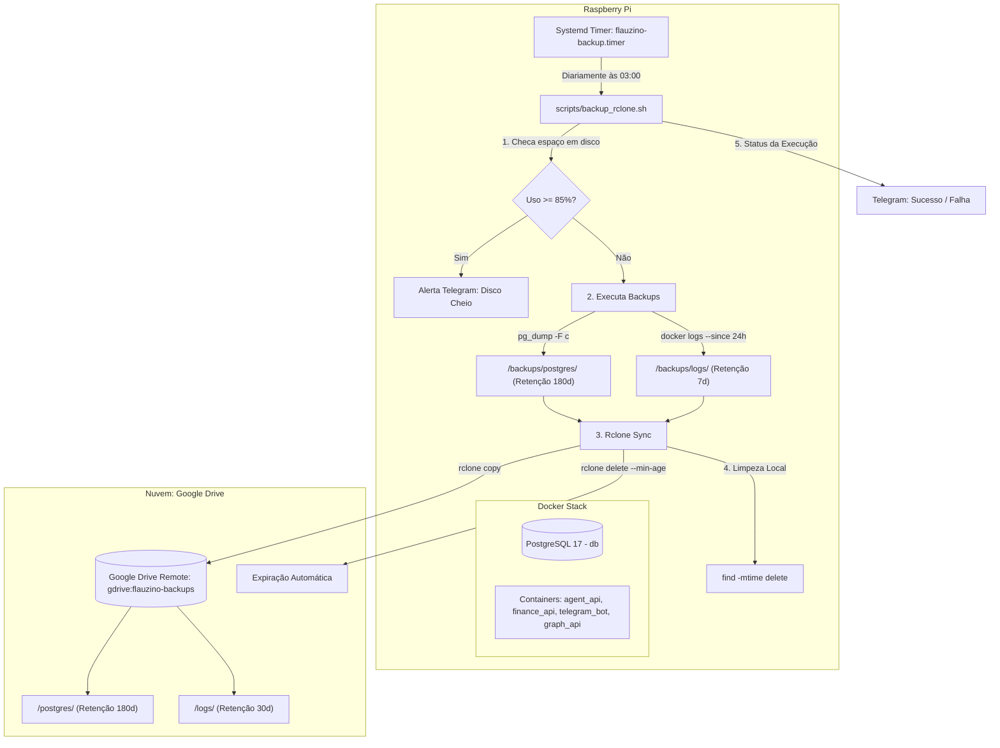

# Especificação Técnica: Backup Automatizado com Rclone (Google Drive), Retenção e Proteção do Raspberry Pi

Esta especificação define a arquitetura, regras de retenção, automação e implementação dos backups para a infraestrutura do **Flauzino Assistant** hospedada em um **Raspberry Pi**, sincronizando com o **Google Drive** via **Rclone**.

---

## 1. Objetivos

1. **Persistência de Dados de Longo Prazo:** Garantir histórico de **6 meses (180 dias)** dos backups diários do PostgreSQL (local e remoto no Google Drive).
2. **Retenção de Logs:** Manter **1 mês (30 dias)** de logs de containers na nuvem e **7 dias** localmente no Raspberry Pi.
3. **Proteção do MicroSD:**
   - Evitar esgotamento de disco com teto máximo previsível para os arquivos de backup.
   - Configurar limites rígidos de rotação de logs no Docker (`json-file`).
   - Monitorar a integridade do disco com alerta de limite crítico (>= 85%) via Telegram.
4. **Resiliência e Agendamento Confiável:** Substituir crontabs frágeis por **Systemd Timers** com recuperação automática de tarefas perdidas (`Persistent=true`).

---

## 2. Visão Geral da Arquitetura



---

## 3. Matriz de Retenção e Políticas de Armazenamento

| Categoria | Armazenamento | Política de Retenção | Formato / Estratégia | Estimativa de Volume |
| :--- | :--- | :--- | :--- | :--- |
| **Banco Vivo (Volume Docker)** | Volume `postgres_data` | **Permanente** (nunca expira) | Diretório de dados do Postgres (`/var/lib/postgresql/data`) | ~10 MB a 50 MB / ano |
| **Backup PostgreSQL (Local)** | `$PROJECT_DIR/backups/postgres` | **6 meses (180 dias)** | Formato Custom compactado (`db_YYYYMMDD_HHMMSS.dump`) | ~500 MB a 1.5 GB estável |
| **Backup PostgreSQL (Google Drive)** | `gdrive:flauzino-backups/postgres` | **6 meses (180 dias)** | Cópia idêntica do dump diário | ~500 MB a 1.5 GB |
| **Logs de Aplicações (Local)** | `$PROJECT_DIR/backups/logs` | **7 dias** | Arquivo compactado `.tar.gz` por dia | ~20 MB a 50 MB |
| **Logs de Aplicações (Google Drive)** | `gdrive:flauzino-backups/logs` | **1 mês (30 dias)** | Arquivo `.tar.gz` diário | ~100 MB a 250 MB |

---

## 4. Detalhamento Técnico das Modificações

### 4.1. Limite e Rotação de Logs no Docker (`infra/docker-compose.yml`)
Para evitar que containers sem controle de saída estufem o cartão MicroSD, cada serviço deve ter configuração de log driver delimitada:

```yaml
logging:
  driver: "json-file"
  options:
    max-size: "10m"
    max-file: "3"
```
*Total de teto por container:* 30 MB. Com 6 containers ativos, o teto global de logs ativos no Docker nunca ultrapassará ~180 MB.

### 4.2. Script Unificado de Backup (`scripts/backup_rclone.sh`)
O script [scripts/backup_rclone.sh](file:///Users/joaoflauzino/Documents/projetos/flauzino-assistant/scripts/backup_rclone.sh) unifica e automatiza toda a rotina.

**Funcionalidades:**
1. **Carregamento de Ambiente:** Carrega `.env` do projeto para obter credenciais do Postgres, `RCLONE_REMOTE` e `TELEGRAM_BOT_TOKEN`.
2. **Monitor de Disco:** Executa `df /` e extrai o percentual de uso. Se `>= 85%`, dispara mensagem de alerta emergencial no Telegram.
3. **Dump do Banco:** Executa `docker exec infra-db-1 pg_dump -U ${POSTGRES_USER} -d ${POSTGRES_DB} -F c` diretamente para `$BACKUP_DIR/postgres/db_${TIMESTAMP}.dump`.
4. **Exportação de Logs:** Itera pelos containers ativos (`infra-agent_api-1`, `infra-finance_api-1`, `infra-telegram_bot-1`, `infra-graph_api-1`, `infra-db-1`), salva logs com `--since 24h` e compacta em `apps_logs_${DATE_DAY}.tar.gz`.
5. **Sincronização Rclone (Google Drive):**
   ```bash
   rclone copy "$BACKUP_DIR/postgres/" "gdrive:flauzino-backups/postgres/"
   rclone copy "$BACKUP_DIR/logs/" "gdrive:flauzino-backups/logs/"
   ```
6. **Expiração Remota:**
   ```bash
   rclone delete "gdrive:flauzino-backups/postgres/" --min-age 180d --rmdirs
   rclone delete "gdrive:flauzino-backups/logs/" --min-age 30d --rmdirs
   ```
7. **Expiração Local:**
   ```bash
   find "$BACKUP_DIR/postgres" -name "*.dump" -type f -mtime +180 -delete
   find "$BACKUP_DIR/logs" -name "*.tar.gz" -type f -mtime +7 -delete
   ```
8. **Notificação de Status:** Dispara via Telegram Bot se a operação foi concluída com êxito ou falhou (incluindo tamanho do dump gerado).

### 4.3. Agendamento com Systemd Timer (Servidor)
Substituir a dependência do `cron` por um timer nativo do Linux:

- **Arquivo de Serviço:** `/etc/systemd/system/flauzino-backup.service`
  - Executa como o usuário do host (com acesso ao docker).
  - Executa o script com ambiente controlado e logs direcionados ao `journald`.
- **Arquivo de Timer:** `/etc/systemd/system/flauzino-backup.timer`
  - Horário: `OnCalendar=*-*-* 03:00:00`.
  - Configuração `Persistent=true`: caso o Raspberry Pi esteja desligado ou em reinicialização às 03:00, o backup será executado assim que o sistema inicializar.

---

## 5. Procedimento de Disaster Recovery (Restauração)

Para restaurar um backup a partir do Google Drive em caso de corrupção ou substituição de hardware:

1. **Baixar o backup desejado via Rclone:**
   ```bash
   rclone copy gdrive:flauzino-backups/postgres/db_20260927_030000.dump ./backups/
   ```
2. **Restaurar no container Postgres:**
   ```bash
   # Derrubar conexões e recriar banco limpo
   docker exec -i infra-db-1 psql -U flauzino -d postgres -c "DROP DATABASE assistant WITH (FORCE);"
   docker exec -i infra-db-1 psql -U flauzino -d postgres -c "CREATE DATABASE assistant;"
   # Restaurar o arquivo .dump
   docker exec -i infra-db-1 pg_restore -U flauzino -d assistant -v < ./backups/db_20260927_030000.dump
   ```

---

## 6. Plano de Ação e Entregáveis

- [x] **Etapa 1:** Atualizar [infra/docker-compose.yml](file:///Users/joaoflauzino/Documents/projetos/flauzino-assistant/infra/docker-compose.yml) incluindo as diretivas de `logging` em todos os serviços.
- [x] **Etapa 2:** Desenvolver [scripts/backup_rclone.sh](file:///Users/joaoflauzino/Documents/projetos/flauzino-assistant/scripts/backup_rclone.sh) com suporte a Google Drive, retenções, health check de disco e alertas no Telegram.
- [x] **Etapa 3:** Criar arquivos de configuração do systemd (`infra/server/flauzino-backup.service` e `infra/server/flauzino-backup.timer`) versionados no repositório com instruções no README.
- [x] **Etapa 4:** Testar localmente a execução do script e validar retenções.
