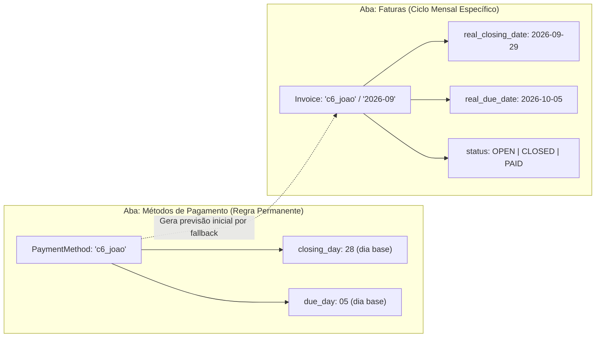

# Spec: Correção do Ciclo de Faturas, Métodos de Pagamento e Evolução das Ferramentas do Agente

**Status:** Concluído (Fases 1 e 2) | Próximo: Correção do Filtro de Faturas no Dashboard (Item 1.7)  
**Data:** 30/09/2026  
**Contexto:** Correção de bugs no ciclo de faturas (PostgreSQL Enum mismatch e cálculo de vencimento com virada de mês), correção na persistência de cartões na aba de Métodos de Pagamento, evolução das ferramentas `consultar_saldos` e `gerar_grafico` para suportar consultas históricas e por mês de referência, unificação da edição de datas de fechamento/vencimento e ciclo de vida de faturas (ações "Pagar Fatura" e "Desfazer Pagamento"), tratamento de métodos não-cartão no dashboard, e anotação preliminar para o futuro módulo de receitas.

---

## 1. Problemas Identificados

### 1.1. Erro de Tipo no PostgreSQL ao Salvar Fatura (`invoice_status_enum`) [RESOLVIDO NA FASE 1]
- **Sintoma:** Ao tentar salvar ou alterar uma data de fechamento via frontend (`InvoicesPage`) ou API (`PUT /invoices/{pm}/{month}/closing-date`), o banco retornava:
  ```text
  UndefinedObjectError: type "invoice_status_enum" does not exist
  ```
- **Causa Raiz:** A coluna `status` era `VARCHAR(20)` no Postgres, mas estava mapeada com enum nativo no SQLAlchemy.

### 1.2. Cadastro e Atualização de Cartões na Aba de Métodos de Pagamento [RESOLVIDO NA FASE 1]
- **Sintoma:** Na aba de Métodos de Pagamento, ao cadastrar ou editar um cartão, o fechamento padrão (`closing_day`), vencimento padrão (`due_day`) e a flag `is_credit_card` não eram salvos no banco.
- **Causa Raiz:** O repositório omitia os campos no método `create` e strings vazias causavam rejeição no schema.

### 1.3. Cálculo de Vencimento Incorreto quando `due_day <= closing_day` [RESOLVIDO NA FASE 1]
- **Sintoma:** Para cartões que fecham no final do mês e vencem no início (ex: fecha 28 e vence 05), a fatura vencia no mesmo mês civil antes de fechar (ex: fechamento 28/09 e vencimento 05/09).
- **Causa Raiz:** O cálculo de vencimento não tratava a virada de mês.

### 1.4. Limitação nas Tools do Agente (`consultar_saldos` e `gerar_grafico`) [RESOLVIDO NA FASE 1]
- **Sintoma:** O assistente não conseguia consultar históricos passados nem gerar gráficos de meses anteriores.
- **Causa Raiz:** Ferramentas não possuíam o parâmetro `mes_referencia` e o backend não filtrava por categorias.

### 1.5. Assimetria na Edição de Datas (Faturas vs Métodos de Pagamento) [RESOLVIDO NA FASE 2]
- **Sintoma:** Na aba **Métodos de Pagamento**, o usuário consegue editar tanto o dia de fechamento quanto o dia de vencimento (regra geral). Porém, na aba **Faturas**, o modal só permitia editar a **Data de Fechamento**, deixando a **Data de Vencimento** fixa no cálculo automático.
- **Causa Raiz:** Endpoint e modal estavam restritos apenas a `closing_date`.

### 1.6. Ausência do Ciclo de Vida da Fatura e Ação "Pagar Fatura" [RESOLVIDO NA FASE 2]
- **Sintoma:** As faturas eram criadas com `status = 'OPEN'`, mas a coluna de status sequer era exibida na tabela da tela de Faturas e não era possível liquidar ou desfazer o pagamento.
- **Causa Raiz:** Falta de endpoints dedicados para transição de status (`pay` / `reopen`) e ausência dos componentes visuais correspondentes no frontend.

### 1.7. Erro 500 no Dashboard ao Filtrar por Fechamento de Fatura (`is not a credit card`) [A IMPLEMENTAR]
- **Sintoma:** Ao selecionar o modo **"Fechamento de Fatura"** (`mode=INVOICES`) no filtro do Dashboard de Gastos, a API retorna:
  ```text
  Internal Server Error: Payment method pix_joao is not a credit card.
  ```
- **Causa Raiz:**
  - O método `_resolve_invoice_periods` em `finance_api/services/spents.py` itera sobre **todos** os métodos de pagamento cadastrados no banco e chama cegamente `get_invoice_dates(pm, reference_month)`.
  - Como `get_invoice_dates` lança `ValueError("... is not a credit card")` para qualquer método com `is_credit_card == False` (ex: `pix_joao`, `dinheiro`), a requisição inteira quebra com erro 500.
- **Solução:**
  - Em `_resolve_invoice_periods` (e analogamente em `balances.py`):
    - Se `pm.is_credit_card == True`: resolve as datas da fatura via `inv_service.get_invoice_dates`.
    - Se `pm.is_credit_card == False`: resolve como o **mês civil** correspondente (do 1º ao último dia do mês de referência), permitindo que gastos à vista (Pix, dinheiro) continuem aparecendo no dashboard sem disparar erro.

---

## 2. Visão Geral da Arquitetura: Regra Padrão vs Fatura Mensal



1. **Métodos de Pagamento (Cadastro Base):** Define as regras padrão que valem indefinidamente (`closing_day` e `due_day`, números de 1 a 31).
2. **Faturas (Instâncias Mensais):** Cada mês civil de referência tem sua própria fatura com datas reais completas (`real_closing_date` e `real_due_date`) e um status (`OPEN`, `CLOSED`, `PAID`). Tanto o fechamento quanto o vencimento podem ser livremente ajustados no ciclo mensal.

---

## 3. Esclarecimento: O Papel do Campo `status` (`OPEN`, `CLOSED`, `PAID`)

### 3.1. Como ele se comporta HOJE no sistema:
- O campo `status` é atualmente de **controle visual e ciclo de vida operacional**:
  - `OPEN`: A fatura está em curso, recebendo novas despesas até a data de corte (`real_closing_date`).
  - `CLOSED`: A fatura atingiu a data de corte e está fechada, aguardando liquidação até a data de vencimento (`real_due_date`).
  - `PAID`: A fatura foi liquidada/paga pelo usuário.
- **Ele bloqueia ou esconde gastos em outros lugares hoje?**
  - **NÃO.** Nem o dashboard (`/spents/dashboard`), nem a consulta de saldos (`/limits/balance`), nem as ferramentas do assistente filtram gastos com base no status da fatura ser `PAID` ou `OPEN`. O cálculo de despesas sempre soma todos os gastos atribuídos àquele intervalo de datas.

### 3.2. Onde o status influenciará no FUTURO:
1. **Módulo de Receitas e Fluxo de Caixa (Item 6):**
   - No fluxo de caixa futuro, uma fatura com status `PAID` indicará que o saldo bancário da conta de origem já sofreu a dedução do valor total daquela fatura na data de vencimento. Faturas `OPEN` ou `CLOSED` constarão como "Passivos / Contas a Pagar Previstas".
2. **Prevenção de Lançamentos Retroativos:**
   - Possibilidade de alertar o usuário se ele tentar lançar uma despesa com data de compra que caia em uma fatura que já foi marcada como `PAID`.

---

## 4. Detalhamento Técnico das Alterações

### 4.1 a 4.4. (Implementados e verificados na Fase 1)
- Correção do modelo `Invoice` (`native_enum=False`).
- Persistência de cartões em `PaymentMethodRepository` e formulário frontend.
- Virada inteligente de mês no cálculo de vencimento (`get_due_reference_month`).
- Parâmetro `categories` em `GET /limits/balance` e `mes_referencia` nas tools do agente.

### 4.5. `finance_api`: Endpoints de Ciclo de Vida da Fatura (Pagar e Desfazer Pagamento) [RESOLVIDO NA FASE 2]
**Arquivo:** `finance_api/routers/invoices.py`
- Endpoints `PUT /{pm}/{ref_month}`, `POST /{pm}/{ref_month}/pay` e `POST /{pm}/{ref_month}/reopen`.
- Refatorado com injeção de dependência `Depends(get_invoice_service)` e schemas em `finance_api/schemas/invoices.py`.

### 4.6. `frontend`: Coluna de Status, Edição Completa, Pagar Fatura e Desfazer Pagamento [RESOLVIDO NA FASE 2]
**Arquivo:** `frontend/src/pages/InvoicesPage.tsx`
- Badges estilizadas para `OPEN`, `CLOSED`, `PAID`.
- Botão "Pagar Fatura" e botão "Desfazer" para reabrir pagamento acidental.
- Edição de fechamento, vencimento e status no modal.

### 4.7. `finance_api`: Resolução de Períodos Misto (Cartão vs À Vista) no Dashboard [A IMPLEMENTAR]
**Arquivos:** `finance_api/services/spents.py` e `finance_api/services/balances.py`
- Em `_resolve_invoice_periods`:
  ```python
  for pm in payment_methods:
      if pm.is_credit_card:
          start_d, end_d = await active_inv.get_invoice_dates(pm, reference_month)
      else:
          # Para Pix, Dinheiro, Débito: usar o mês civil como período correspondente
          year, month = map(int, reference_month.split("-"))
          _, last_day = calendar.monthrange(year, month)
          start_d = date(year, month, 1)
          end_d = date(year, month, last_day)
      periods.append((pm.key, start_d, end_d))
  ```

---

## 5. Critérios de Aceite

### Fase 1 (Concluída):
- [x] Na tela **Faturas** do frontend, a alteração de data salva com sucesso sem erro de `invoice_status_enum`.
- [x] Na tela **Métodos de Pagamento** do frontend, criar ou editar cartões salva os campos `is_credit_card`, `closing_day` e `due_day` com sucesso no banco.
- [x] Cartões com `due_day <= closing_day` têm a data de vencimento calculada para o mês seguinte.
- [x] Se o usuário não informar data no chat, `consultar_saldos` consulta o ciclo ativo do momento.
- [x] Se o usuário pedir histórico, `consultar_saldos` passa `mes_referencia="YYYY-MM"` e traz os dados daquele mês.
- [x] Pedir gráfico de um mês específico gera o gráfico com os dados daquele mês.

### Fase 2 (Concluída):
- [x] Na tela **Faturas**, o modal de edição permite alterar tanto a **Data de Fechamento Real** quanto a **Data de Vencimento Real**.
- [x] A tabela de **Faturas** exibe a coluna **STATUS** indicando visualmente se a fatura está `OPEN`, `CLOSED` ou `PAID`.
- [x] A tela de **Faturas** disponibiliza o botão **"Pagar Fatura"**, que aciona o backend e atualiza o status para `PAID`.
- [x] Quando a fatura estiver paga, a tela disponibiliza o botão **"Desfazer"**, acionando `POST /invoices/{pm}/{month}/reopen` e retornando o status para `OPEN`.
- [x] O modal de edição de faturas permite alterar livremente o status da fatura (`OPEN`, `CLOSED`, `PAID`).

### Item 1.7 (Dashboard com Filtro de Faturas):
- [x] No Dashboard do Frontend, selecionar o filtro **"Fechamento de Fatura"** carrega os gastos com sucesso sem erro 500 mesmo tendo métodos como `pix_joao` ou `dinheiro`.
- [x] Os gastos feitos com cartão respeitam o período da fatura, enquanto os gastos feitos via Pix/débito/dinheiro respeitam o mês civil correspondente.

---

## 6. Visão Futura: Módulo de Receitas / Ganhos (Incomes)

> [!WARNING]
> ### ⚠️ ATENÇÃO: ESTE ITEM É UMA PROPOSTA GENÉRICA PRELIMINAR.
> ### **PRECISAMOS EVOLUIR E REFINAR ESTA ESPECIFICAÇÃO ANTES DE QUALQUER IMPLEMENTAÇÃO!**

### 6.1. Motivação e Ideia Inicial
Atualmente, o sistema gerencia exclusivamente o lado das saídas financeiras:
- Gastos (`spents`)
- Limites de gastos (`spending_limits`)
- Assinaturas/recorrências (`subscriptions`)
- Faturas de cartões (`invoices`)

Não existe hoje a contrapartida de **Receitas (Incomes)** — como salários, pró-labores, rendimentos, reembolsos, vendas ou recebimentos via Pix.

### 6.2. Diretriz Arquitetural Fundamental: Independência Total dos Gastos
- **TOTALMENTE DESACOPLADO E INDEPENDENTE DOS GASTOS:**
  - O sistema precisa ser capaz de rodar normalmente hoje contendo apenas o fluxo de gastos (`spents`).
  - Quando a funcionalidade de receitas for introduzida futuramente, o design deve ser estritamente **aditivo** (*plug-and-play*): **SEM DATA MIGRATION**, sem refatoração destrutiva em tabelas legadas e sem quebrar os dados históricos já salvos.
  - As tabelas de `spents`, `limits` e `invoices` continuam operando de forma autônoma. O módulo de receitas existirá como uma camada complementar independente, que apenas soma/agrega informações nos dashboards e nas respostas do assistente quando houver dados presentes.

### 6.3. Pontos que Precisam ser Desenhados e Decididos Futuramente:
1. **Modelagem de Dados Autônoma:**
   - Criar nova entidade isolada `Income` (`amount`, `source`, `category_income`, `received_at`, `account_or_method`, `is_recurring`), sem chaves estrangeiras rígidas que engessem a tabela de gastos.
2. **Impacto no Dashboard e Gráficos:**
   - Balanço líquido mensal opcional/aditivo: `Receitas - Despesas = Saldo Restante`.
   - Comparativo visual (Barras de Receitas vs Despesas por mês civil) apenas se o usuário tiver receitas cadastradas.
3. **Impacto no Assistente e Tools:**
   - Nova tool independente `registrar_receita(...)`.
   - Evolução de `consultar_saldos` para informar tanto o teto dos limites de gastos quanto o saldo geral da conta considerando o dinheiro que entrou.
