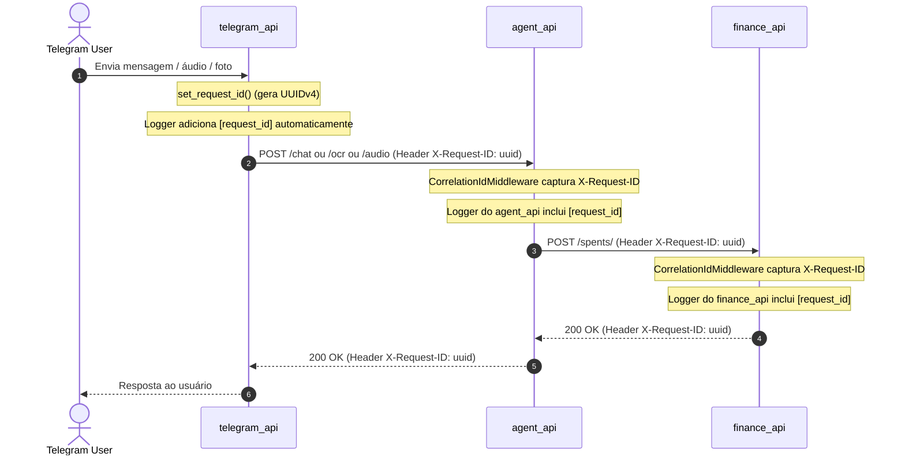

# Plano de Implementação — Correlation ID (X-Request-ID)

Este plano especifica a implementação de rastreamento distribuído (Distributed Tracing) via Correlation ID (`X-Request-ID`) entre todos os serviços do **Flauzino Assistant** (`telegram_api` → `agent_api` → `finance_api`).

---

## 1. Visão Geral da Arquitetura



---

## 2. Detalhamento por Componente

### 2.1. Módulo de Correlação (`core/correlation.py`)
Criar em:
- `telegram_api/core/correlation.py`
- `agent_api/core/correlation.py`
- `finance_api/core/correlation.py`

**Contrato:**
- `CORRELATION_HEADER = "X-Request-ID"`
- `request_id_ctx: ContextVar[str]`
- `get_request_id() -> str`: retorna o ID ativo no contexto assíncrono atual.
- `set_request_id(request_id: str | None = None) -> str`: define ou gera um novo UUIDv4.

### 2.2. Injeção Automática no Logger (`core/logger.py`)
Adicionar um `logging.Filter` em cada serviço:
```python
class CorrelationIdFilter(logging.Filter):
    def filter(self, record: logging.LogRecord) -> bool:
        record.request_id = get_request_id() or "-"
        return True
```
Padronizar o formato para:
```text
[%(asctime)s] [%(levelname)s] [%(request_id)s] [%(name)s] %(message)s
```

### 2.3. Middleware ASGI/FastAPI (`agent_api` e `finance_api`)
- Criar `CorrelationIdMiddleware(BaseHTTPMiddleware)` em `agent_api/core/middlewares.py` e `finance_api/core/middlewares.py`.
- Intercepta requisições HTTP:
  - Extrai `X-Request-ID` dos headers ou gera um novo via `set_request_id()`.
  - Executa a requisição (`await call_next(request)`).
  - Anexa `response.headers["X-Request-ID"] = request_id`.
- Registrar o middleware em `agent_api/main.py` e `finance_api/main.py`.

### 2.4. Propagação HTTP na `agent_api` (`FinanceService`)
- No arquivo `agent_api/services/finance.py`:
  - Nas chamadas de `self.client.post(...)` e `self.client.get(...)`, injetar o header:
    ```python
    headers = {"X-Request-ID": get_request_id()} if get_request_id() else {}
    ```

### 2.5. Propagação HTTP na `telegram_api` (`http_client.py` e Handlers)
- Nos métodos de `telegram_api/core/http_client.py`:
  - `send_message_to_agent`, `send_receipt_to_agent`, `send_audio_to_agent`, `get_balance_graph`, `save_spent`, `save_subscription`:
  - Obter `req_id = get_request_id() or set_request_id()` e propagar `headers={"X-Request-ID": req_id}`.
- Nos handlers principais (`message_handler.py`, `voice_handler.py`, `photo_handler.py`, `balance_handler.py`, `expense_handler.py`):
  - Chamar `set_request_id()` logo no início para atribuir um ID único àquela interação do usuário.

---

## 3. Plano de Testes

1. **Testes Unitários:**
   - Testar `set_request_id()` e `get_request_id()` nos três serviços.
   - Testar `CorrelationIdFilter` garantindo que `record.request_id` é preenchido.
   - Testar `CorrelationIdMiddleware` no `agent_api` e no `finance_api` via `TestClient`:
     - Caso 1: Quando `X-Request-ID` é passado no request, o mesmo ID é mantido e retornado no response.
     - Caso 2: Quando `X-Request-ID` não é passado, um novo UUID é gerado e retornado no response.
   - Testar se o `FinanceService` do `agent_api` repassa o `X-Request-ID` nas requisições para a `finance_api`.
   - Testar se `telegram_api/core/http_client.py` repassa o header `X-Request-ID`.
2. **Validação de Regressão:**
   - Rodar suíte completa de testes: `uv run pytest`.
   - Executar `make format` e `make lint`.
