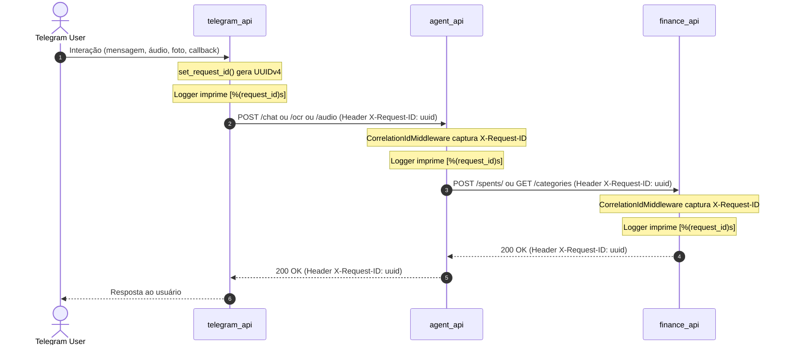

# Walkthrough — Implementação de Correlation ID (Distributed Tracing)

Este documento descreve a implementação do rastreamento distribuído (Distributed Tracing) via Correlation ID (`X-Request-ID`) entre os serviços **telegram_api**, **agent_api** e **finance_api**.

---

## 1. Visão Geral

Com a implementação do Correlation ID, toda requisição ou evento que ingressa no sistema recebe um identificador único (`UUIDv4`) que é:
1. Registrado no contexto assíncrono (`contextvars.ContextVar`).
2. Injetado automaticamente em **todas as linhas de log** dos serviços envolvidos.
3. Propagado nas chamadas HTTP subsequentes através do cabeçalho `X-Request-ID`.
4. Retornado nas respostas HTTP para facilitar a depuração ponta a ponta.

### Fluxo de Propagação



---

## 2. Alterações Realizadas

### 2.1. Módulo de Contexto Assíncrono (`core/correlation.py`)
Criado nos três serviços:
- `telegram_api/core/correlation.py`
- `agent_api/core/correlation.py`
- `finance_api/core/correlation.py`

**Principais funções:**
- `get_request_id() -> str`: Obtém o ID da requisição ativa no contexto atual.
- `set_request_id(request_id: str | None = None) -> str`: Define um ID ou gera um novo `uuid4`.
- `clear_request_id() -> None`: Limpa o ID do contexto assíncrono.
- Constante: `CORRELATION_HEADER = "X-Request-ID"`.

### 2.2. Enriquecimento de Logs (`core/logger.py`)
Atualizado nos três serviços com `CorrelationIdFilter`:
- Injeta o atributo `request_id` (ou `"-"` quando fora de contexto de requisição) em cada `LogRecord`.
- Formato padronizado:
  ```text
  [%(asctime)s] [%(levelname)s] [%(request_id)s] [%(name)s] %(message)s
  ```

### 2.3. Middlewares ASGI para FastAPI (`core/middlewares.py`)
Criado e registrado em:
- `agent_api/core/middlewares.py` e registrado em `agent_api/main.py`.
- `finance_api/core/middlewares.py` e registrado em `finance_api/main.py`.

**Comportamento:**
- Intercepta requisições HTTP e extrai o cabeçalho `X-Request-ID`.
- Se presente, reutiliza o ID recebido; se ausente, gera um novo UUID.
- Define o contexto com `set_request_id(req_id)` e garante limpeza no bloco `finally`.
- Injeta `response.headers["X-Request-ID"] = req_id` na resposta.

### 2.4. Propagação HTTP no `agent_api` (`services/finance.py`)
- O `FinanceService` agora injeta o cabeçalho `X-Request-ID` via método auxiliar `_get_headers()` em todas as chamadas HTTP para a `finance_api`:
  - `_post_to_finance_api`
  - `get_balances`
  - `get_categories`
  - `get_payment_methods`

### 2.5. Integração no `telegram_api` (`http_client.py` e Handlers)
- **`http_client.py`:** Todas as chamadas para `agent_api` e `finance_api` enviam o cabeçalho `X-Request-ID`.
- **Handlers (`message_handler`, `voice_handler`, `photo_handler`, `balance_handler`, `expense_handler`):** Invocam `set_request_id()` no início do processamento de cada mensagem ou callback.

---

## 3. Cobertura de Testes

Novos testes unitários foram criados e adicionados à suíte:
- `telegram_api/tests/core/test_telegram_correlation.py`:
  - Validação de geração e recuperação de `request_id`.
  - Validação do `CorrelationIdFilter`.
- `agent_api/tests/core/test_agent_correlation.py`:
  - Validação do `CorrelationIdMiddleware` com e sem cabeçalho `X-Request-ID` existente.
  - Validação do filtro de log e contexto.
- `finance_api/tests/core/test_finance_correlation.py`:
  - Validação do `CorrelationIdMiddleware` com e sem cabeçalho `X-Request-ID`.
  - Validação do filtro de log e contexto.
- `agent_api/tests/services/test_finance_service.py`:
  - Teste de propagação do header `X-Request-ID` pelo `FinanceService`.
- `telegram_api/tests/core/test_http_client.py`:
  - Teste de propagação do header `X-Request-ID` pelo cliente HTTP.

### Resultados da Validação

```bash
uv run pytest
# 183 passed, 17 warnings in ~7s

make format
# All done! ✨ 🍰 ✨ 169 files left unchanged.

make lint
# All checks passed!
```
