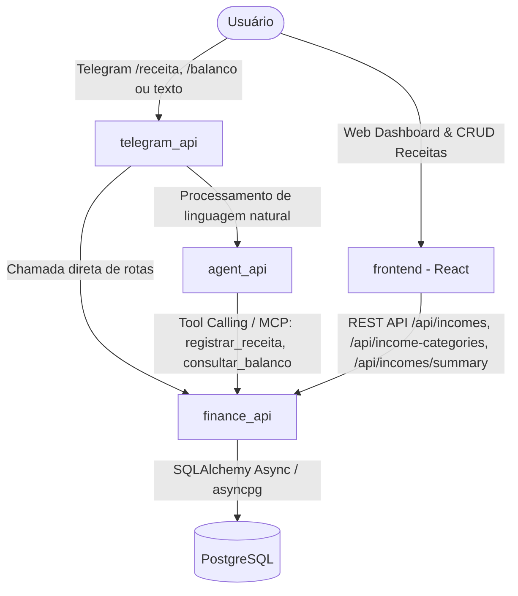
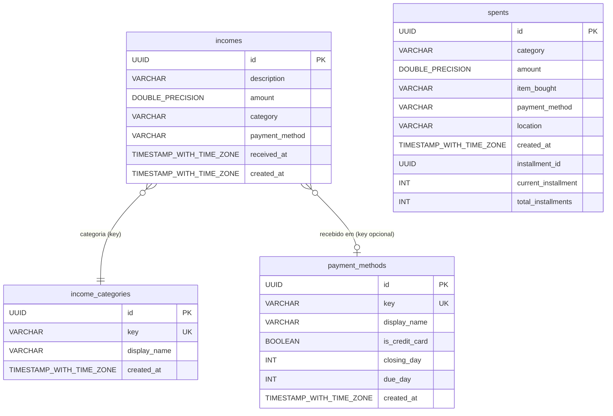

# Plano de Implementação: Feature de Receitas e Balanço Mensal

## 1. Visão Geral da Feature

Atualmente, todo o ecossistema do **Flauzino Assistant** foi projetado com foco em gastos (`spents`), limites (`limits`), faturas de cartão (`invoices`) e assinaturas (`subscriptions`). Embora essa abordagem controle com precisão os custos da família, ela é unidimensional: não há registro de entradas financeiras (salários, transferências via Pix recebidas, premiações, rendimentos de investimentos, reembolsos, etc.).

Sem receitas, é impossível calcular indicadores essenciais de saúde financeira, tais como:
- **Resultado Líquido do Mês (Cash Flow)**: Saber se o mês fechou positivo (superávit) ou negativo (déficit).
- **Taxa de Poupança / Economia**: Percentual da receita retida após as despesas.
- **Balanço Mensal Integrado**: Visão executiva de Entradas vs. Saídas.

Conforme alinhado com o usuário:
1. **Categorias de Receitas Dinâmicas**: Teremos uma tabela dedicada `income_categories` (id, key, display_name) idêntica à `categories` de gastos, permitindo gerenciar e cadastrar novas categorias no banco/frontend e selecionar nos fluxos.
2. **Estratégia de Execução em Etapas**:
   - **Fase 1**: `finance_api` (banco, models, repositories, services, routers REST, testes unitários e MCP).
   - **Fase 2**: `agent_api` (schemas, services, tools do LangChain, prompts do agente e testes).
   - **Fase 3**: `telegram_api` (fluxo interativo `/receita`, comando rápido `/balanco`, mensagens de texto/áudio e testes).
   - **Fase 4**: `frontend` (página de Receitas `/incomes`, cards de KPI e gráficos de Receitas vs Despesas no Painel `/`, testes de build).
   - **Fase 5**: Validação final de ponta a ponta e `walkthrough.md`.

---

## 2. Arquitetura e Diagramas

### 2.1. Fluxo de Dados e Comunicação entre Serviços



### 2.2. Diagrama Entidade-Relacionamento (ERD)



---

## 3. Especificação Detalhada por Camada

### 3.1. `finance_api` (Backend Core)

Seguindo estritamente o padrão `route -> service -> repository` e o decorator `@handle_service_errors`:

#### 3.1.1. Banco de Dados & Infraestrutura
- **Tabelas `income_categories` e `incomes`** no `infra/db/init.sql`:
  ```sql
  -- Tabela de Categorias de Receitas
  CREATE TABLE IF NOT EXISTS income_categories (
      id UUID PRIMARY KEY DEFAULT gen_random_uuid(),
      key VARCHAR(50) NOT NULL UNIQUE,
      display_name VARCHAR(100) NOT NULL,
      created_at TIMESTAMP WITH TIME ZONE DEFAULT CURRENT_TIMESTAMP
  );

  CREATE INDEX IF NOT EXISTS ix_income_categories_key ON income_categories (key);

  -- Seeds para income_categories
  INSERT INTO income_categories (key, display_name) VALUES
      ('salario', 'Salário'),
      ('pix', 'Pix Recebido'),
      ('premiacao', 'Premiação / Bônus'),
      ('investimentos', 'Rendimentos / Investimentos'),
      ('reembolso', 'Reembolso'),
      ('outros', 'Outros')
  ON CONFLICT (key) DO NOTHING;

  -- Tabela de Receitas
  CREATE TABLE IF NOT EXISTS incomes (
      id UUID PRIMARY KEY DEFAULT gen_random_uuid(),
      description VARCHAR NOT NULL,
      amount DOUBLE PRECISION NOT NULL,
      category VARCHAR(50) NOT NULL,
      payment_method VARCHAR(50),
      received_at TIMESTAMP WITH TIME ZONE DEFAULT CURRENT_TIMESTAMP,
      created_at TIMESTAMP WITH TIME ZONE DEFAULT CURRENT_TIMESTAMP,
      CONSTRAINT fk_income_category
          FOREIGN KEY(category)
          REFERENCES income_categories(key)
          ON DELETE RESTRICT,
      CONSTRAINT fk_income_payment_method
          FOREIGN KEY(payment_method)
          REFERENCES payment_methods(key)
          ON DELETE SET NULL
  );

  CREATE INDEX IF NOT EXISTS ix_incomes_category ON incomes (category);
  CREATE INDEX IF NOT EXISTS ix_incomes_received_at ON incomes (received_at);
  CREATE INDEX IF NOT EXISTS ix_incomes_payment_method ON incomes (payment_method);
  ```

#### 3.1.2. Modelos SQLAlchemy
- `finance_api/models/income_categories.py`: `IncomeCategory`
- `finance_api/models/incomes.py`: `Income`

#### 3.1.3. Schemas Pydantic
- `finance_api/schemas/income_categories.py`:
  - `IncomeCategoryCreate`, `IncomeCategoryUpdate`, `IncomeCategoryResponse`
- `finance_api/schemas/incomes.py`:
  - `IncomeBase`, `IncomeCreate`, `IncomeUpdate`, `IncomeResponse`
  - `MonthlyBalanceSummary`:
    - `reference_month: str` (YYYY-MM)
    - `total_incomes: float`
    - `total_spents: float`
    - `net_balance: float` (incomes - spents)
    - `is_positive: bool`
    - `savings_rate: float` (% poupado)
    - `incomes_by_category: dict[str, float]`
    - `spents_by_category: dict[str, float]`

#### 3.1.4. Repositórios
- `finance_api/repositories/income_categories.py`: CRUD e busca por chave.
- `finance_api/repositories/incomes.py`: CRUD, listagem com paginação e filtros por data/categoria, cálculo de agregados e somas por período.

#### 3.1.5. Serviços
- `finance_api/services/income_categories.py`: Regras de negócio e unicidade de chave.
- `finance_api/services/incomes.py`:
  - Valida se `category` existe em `income_categories`.
  - Valida se `payment_method` (se informado) existe em `payment_methods`.
  - Método `get_monthly_summary(reference_month: str) -> MonthlyBalanceSummary`:
    - Busca receitas do mês (`received_at`).
    - Busca gastos do mês (`SpentRepository.list(...)`).
    - Agrega valores e calcula `net_balance`, `is_positive` e `savings_rate`.

#### 3.1.6. Roteadores
- `finance_api/routers/income_categories.py`:
  - `POST /income-categories/`
  - `GET /income-categories/`
  - `GET /income-categories/{category_id}`
  - `PATCH /income-categories/{category_id}`
  - `DELETE /income-categories/{category_id}`
- `finance_api/routers/incomes.py`:
  - `POST /incomes/`
  - `GET /incomes/`
  - `GET /incomes/summary?reference_month=YYYY-MM`
  - `GET /incomes/{income_id}`
  - `PATCH /incomes/{income_id}`
  - `DELETE /incomes/{income_id}`
- Registro dos novos routers no `finance_api/main.py`.

#### 3.1.7. Ferramentas MCP (`finance_api/mcp/tools.py`)
- `@mcp.tool() async def create_income(...)`
- `@mcp.tool() async def list_income_categories() -> list[dict]`
- `@mcp.tool() async def get_monthly_cashflow(reference_month: str | None = None) -> dict`

---

### 3.2. `agent_api` (Camada de IA)

#### 3.2.1. Schemas (`agent_api/schemas/income.py` e `assistant.py`)
- `IncomeDetails`: `fonte`, `valor`, `categoria`, `metodo_recebimento`.
- Atualizar `AssistantResponse` com `income_details`.

#### 3.2.2. Integração HTTP (`agent_api/services/finance.py`)
- `get_income_categories() -> list[str]` (com cache in-memory TTL)
- `save_income(details: IncomeDetails) -> dict`
- `get_monthly_summary(reference_month: str | None = None) -> dict`

#### 3.2.3. Tools do Agente (`agent_api/services/tools.py`)
- `@tool registrar_receita(fonte: str, valor: float, categoria: str, metodo_recebimento: str | None)`
- `@tool consultar_balanco_mensal(mes_referencia: str | None = None)`

#### 3.2.4. Prompts do Agente (`agent_api/services/agent.py`)
- Inclusão das categorias válidas de receita no system prompt (`valid_income_categories`).
- Regra de confirmação para registro de receitas (`["Sim", "Não"]`).
- Suporte a perguntas como: *"Fechei o mês no positivo?"*, *"Qual o balanço de agosto?"*, *"Registra salário de 5000 no Itaú"*.

---

### 3.3. `telegram_api` (Bot do Telegram)

#### 3.3.1. Fluxo Guiado (`telegram_api/handlers/income_handler.py`)
- Implementação de `income_conv_handler` com comando `/receita`:
  - Passo 1: Selecionar Categoria (botões inline a partir de `/income-categories/`).
  - Passo 2: Digitar Descrição/Fonte (ex: "Salário").
  - Passo 3: Digitar Valor (ex: 5000.00).
  - Passo 4: Selecionar Conta/Método de Recebimento (botões inline a partir de `/payment-methods/` ou opção "Pular").
  - Passo 5: Confirmação e chamada para `save_income`.

#### 3.3.2. Comando de Balanço (`telegram_api/handlers/balance_handler.py`)
- Comando `/balanco`:
  - Consulta `GET /incomes/summary`.
  - Exibe resumo visual elegante:
    - 💰 **Receitas**: R$ 8.500,00
    - 💸 **Despesas**: R$ 4.200,00
    - 🟢 **Saldo Líquido**: R$ +4.300,00 (Superávit)
    - 📊 **Taxa de Economia**: 50.6%

#### 3.3.3. Ajuda e Comandos
- Atualização em `/start` e `/help`.
- Registro dos handlers em `telegram_api/main.py`.

---

### 3.4. `frontend` (Painel Web React)

#### 3.4.1. Tipos e Modelo (`frontend/src/types/index.ts`)
- Tipos `Income`, `IncomeCategory`, `MonthlyBalanceSummary`.

#### 3.4.2. Página de Receitas (`frontend/src/pages/IncomesPage.tsx`)
- Tabela paginada com colunas: Data, Descrição, Categoria, Conta/Método, Valor, Ações.
- Filtros por intervalo de datas.
- Modal de Criação e Edição.
- Modal de Confirmação de Exclusão.

#### 3.4.3. Painel Principal (`frontend/src/pages/Dashboard.tsx`)
- Adição dos **Cards de Indicadores de Topo (KPIs)**:
  1. 💰 **Receitas do Mês** (Verde)
  2. 💳 **Despesas do Mês** (Vermelho)
  3. ⚖️ **Resultado do Mês / Saldo Líquido** (Verde se positivo, Vermelho se negativo, com badge `POSITIVO / SUPERÁVIT` ou `NEGATIVO / DÉFICIT`)
  4. 📈 **Taxa de Economia** (% poupada da receita)
- Adição de gráfico comparativo de barras/colunas: **Entradas vs Saídas**.

#### 3.4.4. Menu de Navegação (`frontend/src/App.tsx`)
- Inclusão do link **Receitas** com ícone `TrendingUp` no menu lateral.

---

## 4. Plano de Testes Automatizados

- **`finance_api`**:
  - `tests/repositories/test_income_categories_repository.py`
  - `tests/repositories/test_incomes_repository.py`
  - `tests/services/test_income_categories_service.py`
  - `tests/services/test_incomes_service.py`
  - `tests/routers/test_income_categories_router.py`
  - `tests/routers/test_incomes_router.py`
- **`agent_api`**:
  - `tests/services/test_finance_service_income.py`
  - `tests/services/test_tools_income.py`
  - `tests/services/test_agent_service_income.py`
- **`telegram_api`**:
  - `tests/handlers/test_income_handler.py`
  - `tests/handlers/test_balance_summary_handler.py`
- **`frontend`**:
  - Validação estática TypeScript e compilação do bundle via `npm run build`.
- **Geral**:
  - `uv run pytest` (garantindo 100% de sucesso sem quebra de regressão).
  - `make format` e `make lint`.
