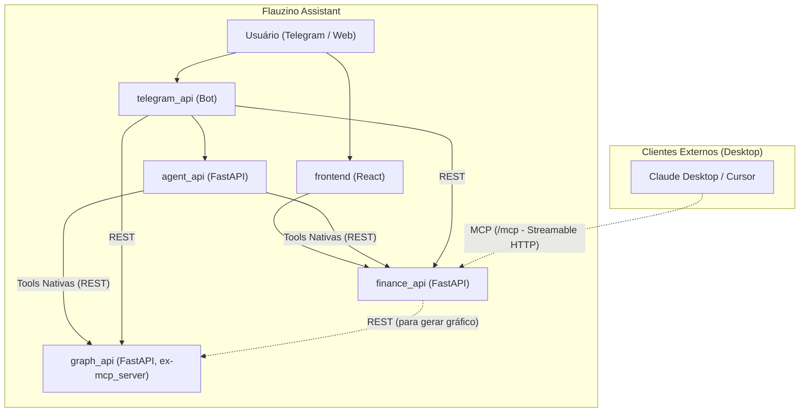

# Plano de Implementação: Tools Nativas no `agent_api`, `graph_api` REST Pura e MCP na `finance_api`

Esta migração arquitetural elimina a complexidade acidental de usar o protocolo MCP internamente no backend, transforma o `mcp_server` em um serviço REST puro de renderização (`graph_api`), implementa Tools nativas no `agent_api` e centraliza o servidor MCP na `finance_api` como interface para agentes de desktop (Claude Desktop, Cursor, etc.).

## Visão Geral da Arquitetura Alvo

---

## Decisões Principais

- O diretório `mcp_server/` será renomeado para `graph_api/`.
- A dependência do pacote `mcp` será **removida** do `agent_api` e do `graph_api`, sendo adicionada exclusivamente na `finance_api`.
- Variáveis de ambiente como `MCP_SERVER_URL` serão renomeadas para `GRAPH_SERVICE_URL` com retrocompatibilidade onde aplicável.
- O `agent_api` deixará de fazer handshakes MCP por requisição, passando a orquestrar via chamadas HTTP diretas com `httpx`.

---

## Proposta de Mudanças

### 1. `graph_api` (ex-`mcp_server`) — Serviço REST Puro de Gráficos

O `graph_api` deixa de ter conhecimento de banco de dados ou da `finance_api`. Ele se torna uma função pura: recebe dados numéricos/categorias e cospe o binário ou Base64 da imagem PNG gerada via Plotly/Kaleido.

#### [DELETE] `mcp_server/services/finance_service.py`
- Removido: o serviço de gráfico não deve fazer chamadas de rede para buscar dados.

#### [DELETE] `mcp_server/services/mcp_service.py` e `mcp_server/core/mcp.py`
- Removidos: a biblioteca MCP e `FastMCP` deixam de existir neste serviço.

#### [NEW] `graph_api/schemas/graphs.py`
- Modelos Pydantic para os payloads de entrada:
  - `BalanceBarChartRequest`: lista de saldos (`category_display_name`, `limit`, `spent`, `available`), `title`, `mode`.
  - `ExpensePieChartRequest`: lista de gastos por categoria (`category_display_name`, `spent`), `title`.
  - `GraphImageResponse`: `{ "image_base64": "..." }`.

#### [MODIFY] `graph_api/routers/graphs.py`
- Endpoints REST limpos:
  - `POST /graphs/bar`: recebe `BalanceBarChartRequest` e devolve `GraphImageResponse` (ou stream PNG).
  - `POST /graphs/pie`: recebe `ExpensePieChartRequest` e devolve `GraphImageResponse`.

#### [MODIFY] `graph_api/main.py`
- FastAPI enxuto, sem lifespan de `session_manager` do MCP. Apenas rotas `/graphs`.

---

### 2. `agent_api` — Tools Nativas e Orquestração Determinística

#### [DELETE] `agent_api/services/mcp_client.py`
- Removido completamente. Sem mais conexões efêmeras ou handshakes JSON-RPC.

#### [NEW] `agent_api/services/tools/`
- `graph_client.py`: client HTTP (`httpx.AsyncClient`) que chama a `graph_api` (`POST /graphs/bar`, `POST /graphs/pie`).
- `finance_client.py`: client HTTP para `finance_api` (reaproveitando / consolidando chamadas existentes).

#### [MODIFY] `agent_api/services/chat.py`
- Quando a LLM sinalizar necessidade de gráfico ou consulta de saldos:
  1. Chama `FinanceService` para obter o JSON de saldos da categoria.
  2. Se foi pedido gráfico, envia os dados obtidos para o `graph_client.generate_bar_chart(...)` ou `generate_pie_chart(...)`.
  3. Devolve a imagem Base64 ao usuário.
- Fluxo 100% determinístico e previsível.

#### [MODIFY] `agent_api/services/llm.py` e `agent_api/schemas/assistant.py`
- Remove o resumo dinâmico de tools via string de MCP (`get_mcp_tools_summary`).
- Define as opções de gráfico suportadas diretamente no prompt de sistema ou schema.

---

### 3. `finance_api` — Servidor MCP para Agentes de Desktop

A `finance_api` é enriquecida com um servidor MCP (`FastMCP`) montado em `/mcp` via Streamable HTTP (ou SSE).

#### [NEW] `finance_api/mcp/`
- `server.py`: Instância do `FastMCP("flauzino-finance")`.
- `tools.py`: Registro das ferramentas expostas aos agentes de desktop:
  - `get_category_balance(month: str | None = None, categories: list[str] | None = None)`: Retorna saldos e limites.
  - `create_spent(category: str, amount: float, description: str, payment_method: str, location: str)`: Registra gasto.
  - `list_categories()`: Lista categorias cadastradas.
  - `get_balance_chart(month: str | None = None, mode: str = "saldo")`: Busca saldos locais, solicita o gráfico via REST para a `graph_api` e retorna a imagem diretamente no MCP (formato `Image(data=..., format="png")`).

#### [MODIFY] `finance_api/main.py`
- Montar o app ASGI do FastMCP em `/mcp`, com o session manager gerenciado no `lifespan`.

---

### 4. Ajustes no `telegram_api`, `infra/` e Configurações

#### [MODIFY] `telegram_api/settings.py` e `telegram_api/handlers/balance_handler.py`
- Renomeia `MCP_SERVER_URL` para `GRAPH_SERVICE_URL` (com fallback).
- Ajusta a chamada de geração de gráfico: busca saldos na `finance_api` e envia para `graph_api` via POST.

#### [MODIFY] `infra/docker-compose.yml`, `pyproject.toml`, `Makefile`
- Atualiza referências de container e diretórios de `mcp_server` para `graph_api`.
- Adiciona `make run-graph` no Makefile.

---

## Verification Plan

### Testes Automatizados
1. **Testes de `graph_api`**:
   - `pytest graph_api/tests`: testar os endpoints `POST /graphs/bar` e `POST /graphs/pie` garantindo geração de PNG válida a partir de dados passados no payload.
2. **Testes de `agent_api`**:
   - `pytest tests/agent_api/`: validar processamento de chat, chamadas mockadas para `finance_api` e `graph_api`.
3. **Testes de MCP na `finance_api`**:
   - Teste unitário de protocolo `tools/list` e `tools/call` das ferramentas expostas no MCP da `finance_api`.

### Verificação Manual
1. Executar `make format` e `make lint`.
2. Testar script `scripts/test_mcp_isolated.py` apontando para `http://localhost:8000/mcp` (`finance_api`).
3. Enviar mensagem de teste via chat no `agent_api` solicitando gráfico de saldo.
