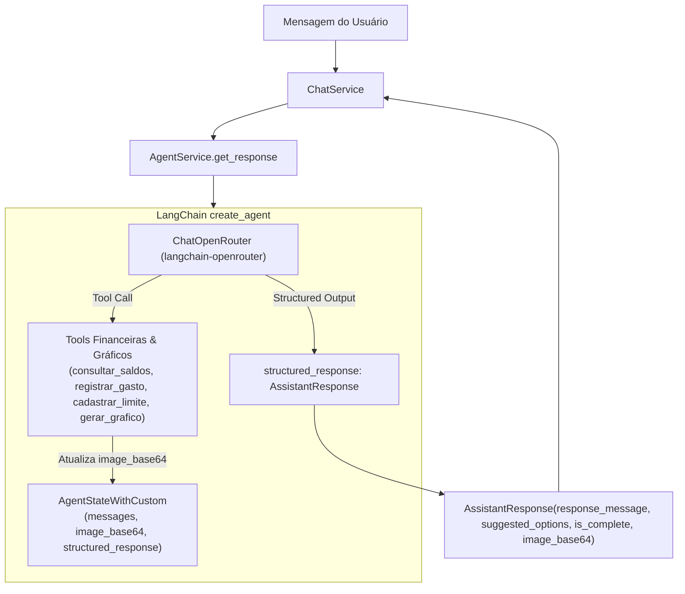

# Especificação e Plano de Implementação: Refatoração para OpenRouter e Saída Estruturada Nativa

Este documento detalha o plano de migração do provedor LLM para o **OpenRouter** através do pacote dedicado `langchain-openrouter` e a substituição da ferramenta artificial `responder_usuario` pelo mecanismo nativo de **Saída Estruturada** (`response_format=AssistantResponse`) no LangChain `create_agent`.

---

## 1. Motivação e Objetivos

1. **Adoção do OpenRouter com `langchain-openrouter`**:
   - Utilizar a biblioteca oficial `langchain-openrouter` (`ChatOpenRouter`) para acesso a modelos com suporte a ferramentas e saída estruturada (como `openrouter/free` ou modelos específicos gratuitos/pagos).
   - Centralizar a configuração de chaves e modelo no `AgentApiSettings` (`OPENROUTER_API_KEY`, `OPENROUTER_MODEL`).

2. **Remoção da Tool `responder_usuario`**:
   - Anteriormente, o modelo era instruído a chamar uma tool `responder_usuario(mensagem=..., opcoes_sugeridas=..., atendimento_finalizado=...)` apenas para empacotar a resposta final.
   - Isso adicionava overhead de chamadas de ferramentas e causava problemas quando o modelo respondia em texto simples sem acionar a tool.

3. **Saída Estruturada Nativa (`AssistantResponse`)**:
   - Passar `response_format=AssistantResponse` diretamente para `create_agent`.
   - O LangChain cuida do schema JSON ou tool call de schema estrito automaticamente.
   - O resultado final do grafo conterá `result["structured_response"]`, uma instância tipada de `AssistantResponse`.
   - Manter a propagação de `image_base64` gerado pelas ferramentas gráficas no state customizado.

---

## 2. Mudanças Arquiteturais



---

## 3. Plano de Alterações por Módulo

### 3.1. Dependências (`agent_api/pyproject.toml`)
- Adicionar `langchain-openrouter` como dependência em `agent_api`.
- Remover ou manter compatibilidade com `langchain-groq` caso necessário, priorizando `ChatOpenRouter`.

### 3.2. Configurações (`agent_api/settings.py` e `.env.example`)
- Adicionar variáveis:
  - `OPENROUTER_API_KEY: str | None = None`
  - `OPENROUTER_MODEL: str = "openrouter/free"`
  - `OPENROUTER_BASE_URL: str = "https://openrouter.ai/api/v1"` (opcional/padrão)
- Atualizar `.env.example` com as chaves correspondentes.

### 3.3. Instanciação do LLM (`agent_api/core/llm.py`)
- Substituir `ChatGroq` por `ChatOpenRouter`:
  ```python
  from langchain_openrouter import ChatOpenRouter
  from agent_api.settings import settings

  @lru_cache
  def get_llm() -> ChatOpenRouter:
      return ChatOpenRouter(
          model=settings.OPENROUTER_MODEL,
          openrouter_api_key=settings.OPENROUTER_API_KEY,
          temperature=0,
          max_retries=2,
      )
  ```

### 3.4. Remoção da Tool `responder_usuario` (`agent_api/services/tools.py`)
- Remover a função `responder_usuario`.
- Remover a injeção do `Command(update={"final_response": ...})` específico de `responder_usuario`.
- Manter as ferramentas operacionais: `consultar_saldos`, `registrar_gasto`, `cadastrar_limite`, `gerar_grafico`.

### 3.5. Refatoração do `AgentService` (`agent_api/services/agent.py`)
- Ajustar `AgentStateWithCustom`:
  ```python
  class AgentStateWithCustom(AgentState[AssistantResponse]):
      image_base64: NotRequired[str | None]
  ```
- Atualizar o `system_prompt`:
  - Remover qualquer menção à ferramenta `responder_usuario`.
  - Definir claramente como preencher os campos do schema estruturado:
    - `response_message`: texto da resposta formatado para o usuário.
    - `suggested_options`: lista de botões/opções rápidas sugeridas (ex: `["Sim", "Não"]`, `["Registrar gasto", "Consultar saldos"]`) ou `null`/vazio.
    - `is_complete`: `True` quando a operação foi finalizada ou conversa encerrada; `False` se aguarda dados ou confirmação.
- Atualizar `create_agent`:
  - Passar `response_format=AssistantResponse`.
- Atualizar extração de resposta em `get_response`:
  - Extrair `structured_resp = result.get("structured_response")`.
  - Injetar `image_base64 = result.get("image_base64")` no `structured_resp`.
  - Manter fallback resiliente caso o modelo não retorne o objeto estruturado.

### 3.6. Atualização de Testes Unitários (`agent_api/tests/services/test_agent_service.py`)
- Atualizar os testes existentes para mockar `structured_response` em vez de `final_response` da antiga tool.
- Validar se `AssistantResponse` é retornado com as propriedades corretas e `image_base64` associado.

---

## 4. Critérios de Validação e Testes
1. `uv sync` ou resolução de dependências com `langchain-openrouter` validada.
2. Execução dos testes automatizados com `pytest agent_api/tests`.
3. Validação do fluxo de gravação de gastos, geração de gráficos e respostas normais sem a tool `responder_usuario`.
