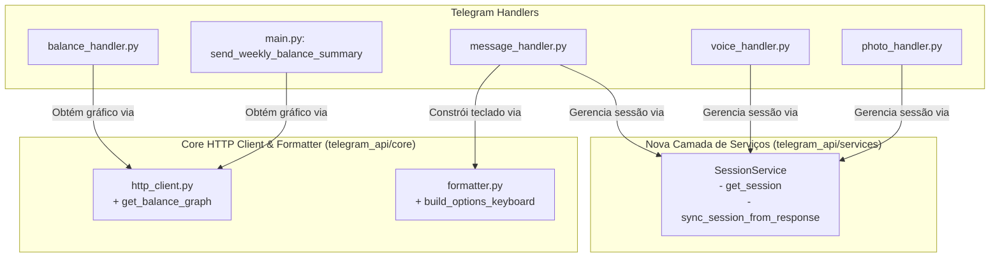

# Plano de Implementação — Refatoração e Melhorias de Qualidade (Telegram API)

Este plano detalha as melhorias de código, desacoplamento, extensibilidade e observabilidade apontadas no documento `.specs/quality-analysis/quality_analysis.md`.

---

## 1. Visão Geral das Mudanças



---

## 2. Detalhamento por Componente

### 2.1. Abstração de Gráficos de Saldo (`telegram_api/core/http_client.py`)
- **Problema:** `balance_handler.py` e `main.py` instanciam `httpx.AsyncClient` avulso diretamente nos handlers/jobs, duplicando lógica de chamada à `finance_api` e `graph_api`.
- **Solução:**
  - Adicionar a função `get_balance_graph(categories: set[str] | None = None, mode: str = "saldo") -> bytes | None` em `telegram_api/core/http_client.py`.
  - Reutiliza o `get_http_client()` global com connection pool e timeout padronizado.
  - Trata status 404 ou saldos vazios retornando `None`.
  - Filtra as categorias selecionadas (se informadas).
  - Envia payload para a `graph_api` e retorna os `bytes` da imagem decodificada.
- **Arquivos modificados:**
  - `telegram_api/core/http_client.py`
  - `telegram_api/handlers/balance_handler.py`
  - `telegram_api/main.py`

### 2.2. Extração de Construtor de Teclado Inline (`telegram_api/core/formatter.py`)
- **Problema:** A montagem do `InlineKeyboardMarkup` a partir de `suggested_options` está duplicada em `handle_text_message` e `handle_agent_callback`.
- **Solução:**
  - Criar `build_options_keyboard(suggested_options: list[str] | None, prefix: str = "agent_opt:", columns: int = 2) -> InlineKeyboardMarkup | None` em `telegram_api/core/formatter.py`.
  - Substituir os blocos duplicados em `message_handler.py`.
- **Arquivos modificados:**
  - `telegram_api/core/formatter.py`
  - `telegram_api/handlers/message_handler.py`

### 2.3. Criação de Serviço de Sessão (`telegram_api/services/session_service.py`)
- **Problema:** `telegram_api/services/` estava vazia e os 3 handlers (`message_handler`, `voice_handler`, `photo_handler`) repetiam exatamente o mesmo bloco `async with get_db() ... SessionRepository ... delete/save_session`.
- **Solução:**
  - Criar `telegram_api/services/session_service.py` com a classe `SessionService` (ou funções utilitárias `get_session_for_chat` e `sync_session_from_response`).
  - Encapsular a interação com `get_db()` e `SessionRepository`:
    ```python
    class SessionService:
        @staticmethod
        async def get_session(chat_id: int) -> str | None: ...

        @staticmethod
        async def sync_session(chat_id: int, response_data: dict[str, Any]) -> None: ...
    ```
  - Refatorar `message_handler.py`, `voice_handler.py` e `photo_handler.py` para usar `SessionService`.
- **Arquivos criados/modificados:**
  - `telegram_api/services/__init__.py`
  - `telegram_api/services/session_service.py`
  - `telegram_api/handlers/message_handler.py`
  - `telegram_api/handlers/voice_handler.py`
  - `telegram_api/handlers/photo_handler.py`

### 2.4. Organização de Imports no Topo em `telegram_api/main.py`
- **Problema:** `send_weekly_balance_summary` possui imports tardios dentro da função (`import httpx`, `import base64`, `from telegram_api.core.database import get_db`, `from sqlalchemy import text`), violando o `AGENTS.md`.
- **Solução:** Mover todos os imports necessários para o topo do arquivo e remover os redundantes (já que `httpx` e `base64` passam a ser usados dentro do `http_client.py`).
- **Arquivos modificados:**
  - `telegram_api/main.py`

### 2.5. Observabilidade: Medição de Tempo e Padronização de Logs
- **Problema:** `telegram_api` não media o tempo das requisições para a `agent_api`, e os formatos de log divergiam entre módulos.
- **Solução:**
  - Adicionar medição com `time.perf_counter()` em `send_message_to_agent`, `send_receipt_to_agent`, `send_audio_to_agent` e `get_balance_graph`, logando o tempo de resposta: `[HTTP] agent_api responded in 1.23s`.
  - Padronizar formato do logger em `telegram_api/core/logger.py` e `agent_api/core/logger.py` para um padrão unificado e legível com timestamp ISO: `[%(asctime)s] [%(levelname)s] [%(name)s] %(message)s`.
- **Arquivos modificados:**
  - `telegram_api/core/http_client.py`
  - `telegram_api/core/logger.py`
  - `agent_api/core/logger.py`

---

## 3. Plano de Testes

1. **Testes Unitários:**
   - Criar `telegram_api/tests/services/test_session_service.py`:
     - Testar recuperação de sessão existente e não existente.
     - Testar `sync_session` quando `is_complete=True` (chama `delete_session`).
     - Testar `sync_session` quando `is_complete=False` e novo `session_id` presente (chama `save_session`).
   - Atualizar `telegram_api/tests/core/test_formatter.py`:
     - Testar `build_options_keyboard` com listas vazias, listas com 1, 2, 3 itens e `None`.
   - Criar/atualizar testes para `get_balance_graph` em `telegram_api/tests/core/test_http_client.py`.
   - Atualizar os testes existentes em `test_message_handler.py`, `test_voice_handler.py`, `test_photo_handler.py` e `test_balance_handler.py` para refletirem a injeção/chamada de `SessionService` e `get_balance_graph`.
2. **Execução de Suíte Completa:**
   - Executar `uv run pytest telegram_api/tests` garantindo 100% de aprovação sem regressões.
   - Executar `uv run pytest agent_api/tests finance_api/tests graph_api/tests`.
   - Executar `make format` e `make lint`.
