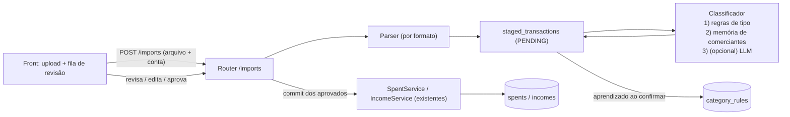

# Plano: Importação de Extratos com Fila de Validação Humana

## 1. Objetivo

Hoje todo lançamento entra **manualmente** (front, Telegram ou IA). A ideia é permitir **subir o extrato do banco** (conta corrente e, depois, cartão), transformar cada linha em uma **transação pendente** (staging), sugerir classificação automaticamente e deixar você **revisar/confirmar** numa seção do front. Só depois da confirmação a transação vira `spents` / `incomes` reais.

> [!IMPORTANT]
> Princípio central: **nada do extrato entra direto em `spents`/`incomes`**. Tudo passa por uma área de staging. A automação só *sugere*; quem *efetiva* é você.

---

## 2. Análise do extrato de exemplo (C6 Conta Corrente)

### 2.1 Formato do arquivo
| Característica | Valor | Impacto no parser |
| :-- | :-- | :-- |
| Encoding | UTF-8 **com BOM**, CRLF | Abrir com `utf-8-sig`, normalizar quebras |
| Preâmbulo | ~7 linhas de metadados (agência, conta, período, data de geração) | Detectar a linha de cabeçalho real (`Data Lançamento,Data Contábil,...`) e ignorar o que vem antes; extrair agência/conta/período como metadado |
| Datas | `dd/mm/yyyy` | Converter para `America/Sao_Paulo` (meio-dia, mesmo padrão já usado) |
| Valores | `Entrada(R$)` e `Saída(R$)` em colunas separadas, ponto decimal | Direção = coluna ≠ 0; parsear com `Decimal` |
| Campos | `Título` (texto principal) + `Descrição` (tipo/complemento) | Guardar ambos; classificar usando `Título` e usar `Descrição` como pista do tipo (PIX, débito, fatura) |
| `Saldo do Dia` | saldo ao fim do dia, repetido em várias linhas | **Não** é saldo por transação. Ignorar na v1 (opcional: conferência de saldo na fase 4) |
| `Data Lançamento` ≠ `Data Contábil` | ex.: 05/09 vs 08/09 | Usar **Data Lançamento** como data da transação; guardar a contábil no raw |
| Linhas idênticas no mesmo dia | `GRUPO LUTA PELA VIDA 30,00` ×2 | Dedup **não** pode ser só `data+valor+descrição` → precisa de contador de ocorrência |

### 2.2 Como cada tipo de linha do exemplo deve ser tratado

| Linha(s) do extrato | Tipo (`kind`) | Sugestão | Observação |
| :-- | :-- | :-- | :-- |
| `CRED SALARIO MENSAL`, `CRED ADTO SALARIO` | `INCOME` | `salario` | regra determinística (alta confiança) |
| `PAGAMENTO PPR/PLR` | `INCOME` | `premiacao` | regra |
| `PGTO FAT CARTAO C6` (7.452,17 / 3.610,14) | `INVOICE_PAYMENT` | vincular ao cartão `c6_card_joao` + mês | **NÃO é despesa** (já contada nas compras do cartão → duplicaria) |
| `NU PAGAMENTOS SA`, `BANCO BRADESCARD S A` | `INVOICE_PAYMENT` (baixa confiança) | você confirma qual cartão | Bradescard não existe nos seus cartões → você decide (ignorar ou cadastrar) |
| `Pix enviado para João Lucas Flauzino Cassiano` (vários), `Pix recebido de JOAO LUCAS…`, `Pix …Lailla…` | `TRANSFER` | ignorar do orçamento | nome bate com **titular de uma conta sua** → movimentação interna |
| `Pix enviado para CEMIG`, `ALGAR` | `EXPENSE` | `moradia` / `servicos` | regra de comerciante; aprende ao confirmar |
| `Pix enviado para ZILMA…` (180 semanal) | `EXPENSE` | sem sugestão na 1ª vez → vira regra | após confirmar 1x, as próximas 3 já vêm sugeridas |
| `Pix enviado para FLAVIA/MAYRA/CELIO…` | `EXPENSE` | **sem sugestão** (pessoa física) | fica na fila para você decidir |
| `Débito de Cartão PAYGO*AUGUSTS BURGE Uberlandia BRA` | `EXPENSE` (`payment_type=DEBIT`) | `comer_fora` | extrair comerciante `AUGUSTS BURGE` e cidade `Uberlandia` → `location` |
| `BRADESCO ADMINISTRADORA DE CONSORCIOS` | `EXPENSE` | `outros` (sugerir criar categoria "consórcio") | |
| `GRUPO LUTA PELA VIDA` ×2 | `EXPENSE` | `outros` | linhas idênticas → ocorrência 1 e 2 |
| `Pix enviado SHPP BRASIL 30,99` + `Devol recebida pix SHPP BRASIL 30,99` | `REFUND` (par) | ignorar o par (líquido zero) | detectar por valor igual + comerciante igual em ±N dias |

> [!NOTE]
> **Transferência interna**, **pagamento de fatura** e **estorno** são o que mais distorce relatório quando se importa extrato "na marra". Tratá-los como `kind` próprio (e não como despesa/receita) é a decisão mais importante do plano.

---

## 3. Arquitetura proposta (dentro de `finance_api`)



### 3.1 Novos módulos
```
finance_api/
├── importers/                 # puro, sem banco: arquivo -> lista de ParsedTransaction
│   ├── base.py                # ParsedTransaction (dataclass) + interface StatementParser
│   ├── registry.py            # detecta qual parser serve (por cabeçalho/extensão)
│   ├── c6_checking_csv.py     # parser do exemplo
│   └── ofx.py                 # (fase 2) genérico p/ bancos que exportam OFX
├── models/        (import_batches.py, staged_transactions.py, category_rules.py)
├── repositories/  (imports.py, staged_transactions.py, category_rules.py)
├── schemas/       (imports.py)
├── services/
│   ├── imports.py             # orquestra upload -> parse -> dedup -> classify -> staging; e o commit
│   └── classification.py      # regras + memória (+ LLM opcional)
└── routers/imports.py
```
Segue o padrão já usado (router → service → repository, `@handle_service_errors`, injeção em `core/dependencies.py`).

### 3.2 Modelo de dados

**`import_batches`** — um upload de arquivo
| Campo | Descrição |
| :-- | :-- |
| `id`, `created_at` | |
| `account_id` / `credit_card_id` | a que conta/cartão o extrato pertence (você escolhe no upload) |
| `parser` | ex.: `c6_checking_csv` |
| `filename`, `file_sha256` | evita subir o mesmo arquivo duas vezes |
| `period_start`, `period_end` | lidos do cabeçalho |
| `status` | `IN_REVIEW` → `COMPLETED` |
| contadores | total, novas, duplicadas, pendentes |

**`staged_transactions`** — uma linha do extrato
| Campo | Descrição |
| :-- | :-- |
| `batch_id`, `account_id`, `credit_card_id` | origem |
| `occurred_at`, `posted_at` | data lançamento / contábil |
| `raw_title`, `raw_description`, `raw_row (JSONB)` | dado original preservado |
| `merchant` | nome normalizado (sem "Pix enviado para", sem `PAYGO*`, caixa alta, sem acento) |
| `amount` (`Numeric`, positivo) + `direction` (`IN`/`OUT`) | |
| `kind` | `EXPENSE`, `INCOME`, `TRANSFER`, `INVOICE_PAYMENT`, `REFUND`, `IGNORED` |
| `payment_type` | `PIX`, `DEBIT`, `TRANSFER`, … (já existe no sistema) |
| `suggested_category`, `suggestion_source` (`RULE`/`MEMORY`/`LLM`), `confidence` | |
| `category` (final), `description` (editável), `location` | o que será gravado |
| `status` | `PENDING` → `APPROVED` → `COMMITTED` (ou `IGNORED` / `DUPLICATE`) |
| `fingerprint` (UNIQUE) | hash — ver §4 |
| `possible_duplicate_of_spent_id / income_id` | aviso de duplicidade com lançamento manual |
| `committed_spent_id / committed_income_id` | rastreabilidade pós-commit |

**`category_rules`** — memória de comerciantes (o "serviço inteligente")
| Campo | Descrição |
| :-- | :-- |
| `pattern`, `match_type` (`EXACT`/`CONTAINS`) | merchant normalizado |
| `direction`, `kind`, `category`, `payment_type?` | o que aplicar |
| `hits`, `source` (`SEED`/`LEARNED`), `updated_at` | |

Alterações em tabelas existentes (`init.sql` + `ALTER TABLE ... ADD COLUMN IF NOT EXISTS`):
- `spents`/`incomes`: `source VARCHAR(20) DEFAULT 'MANUAL'` (`MANUAL` | `IMPORT`) e `import_ref UUID NULL`.

---

## 4. Idempotência e duplicidade (ponto crítico)

Reenviar um extrato com período sobreposto (ex.: 04/08–03/10 e depois 01/09–31/10) **não pode** duplicar nada.

1. **Fingerprint por linha** = `sha256(conta_ou_cartão | data_lançamento | valor | direção | título normalizado | n-ésima ocorrência)`.
   O *n-ésimo* resolve `GRUPO LUTA PELA VIDA 30,00` ×2 no mesmo dia. `UNIQUE(fingerprint)` → linha já importada é descartada (contada como "já existia").
2. **Hash do arquivo** → bloqueia reenvio idêntico com mensagem clara.
3. **Duplicata com lançamento manual** (você já registrou o gasto pelo Telegram/IA): procurar `spents`/`incomes` da mesma conta com **mesmo valor e data ±3 dias**. Se achar, marcar `possible_duplicate_of_*` e exibir no front com ações: **"É o mesmo → vincular (não criar)"** ou **"Não é → criar mesmo assim"**.

---

## 5. Classificação (do simples ao inteligente)

Pipeline por transação, parando no primeiro que decidir:

1. **Regras de tipo (determinísticas)** — definem `kind`:
   - `PGTO FAT CARTAO <banco>` / `NU PAGAMENTOS` / `BRADESCARD` → `INVOICE_PAYMENT`
   - Pix de/para **nome de titular de uma conta sua** → `TRANSFER`
   - `Devol recebida pix` → `REFUND`
   - `CRED SALARIO`, `ADTO SALARIO`, `PPR/PLR` → `INCOME` + categoria
2. **Memória de comerciantes (`category_rules`)** — seed inicial (CEMIG→moradia, ALGAR→servicos, …) + **aprendizado**: toda vez que você confirma uma categoria, grava/atualiza a regra daquele comerciante. É isso que faz o sistema "ficar esperto" com o uso, sem custo.
3. **LLM (já no MVP)** — para o que sobrou sem sugestão: chamada **em lote** do `finance_api` ao `agent_api` (já tem o LLM configurado) via HTTP.
   - Novo endpoint no `agent_api` (ex.: `POST /classify-transactions`): recebe lista `{id, merchant, raw_title, raw_description, direction, amount}` + categorias válidas (despesa/receita) e devolve `[{id, category, confidence}]` com **saída estruturada restrita às categorias válidas** (qualquer valor fora da lista é descartado).
   - Sempre vira *sugestão* (badge "IA"), **nunca** aprovação automática; `confidence` baixa → fica sem sugestão.
   - **Degradação graciosa**: se o `agent_api`/LLM estiver fora, timeout ou erro, o import **não falha** — segue só com regras + memória e o lote é marcado como "sem IA" (dá para reclassificar depois).
   - Só envia linhas de `kind` EXPENSE/INCOME ainda sem sugestão (transferências/faturas não vão ao LLM); enviar apenas o necessário (sem saldo, agência ou conta).

Cada sugestão carrega `confidence`; no front, itens de alta confiança podem ser aprovados em lote com um clique.

---

## 6. API (`finance_api`)

| Método | Rota | Função |
| :-- | :-- | :-- |
| `POST` | `/imports` | upload (`multipart`: arquivo + `account_id` **ou** `credit_card_id`) → cria batch, parseia, dedup, classifica, devolve resumo |
| `GET` | `/imports` | lista de lotes (data, arquivo, nº pendentes) |
| `GET` | `/imports/transactions?status=PENDING&batch_id=` | fila de revisão (paginada) |
| `PATCH` | `/imports/transactions/{id}` | editar `category`, `kind`, `description`, `location`; ignorar |
| `POST` | `/imports/transactions/bulk` | ação em lote (aprovar / ignorar / definir categoria) |
| `POST` | `/imports/transactions/{id}/link` | vincular a spent/income existente (duplicata) |
| `POST` | `/imports/commit` | efetivar **todas as aprovadas** (ou de um batch) → cria `spents`/`incomes` |
| `GET` | `/imports/summary` | contagem de pendentes (badge do menu) |
| `GET/POST/DELETE` | `/import-rules` | gerenciar a memória de comerciantes |

**Commit reaproveita `SpentService`/`IncomeService`** (não escreve direto na tabela) para manter as mesmas validações de categoria/conta/cartão:
- `EXPENSE` → `spents`: `item_bought` = descrição, `location` = cidade/comerciante, `payment_type` e `account_id`/`credit_card_id` da origem.
- `INCOME` → `incomes`: `description`, `category`, `account_id`.
- `TRANSFER` / `REFUND` / `IGNORED` → **não** geram lançamento (ficam no staging para manter o dedup).
- `INVOICE_PAYMENT` → não gera despesa; opcionalmente marca a fatura (`invoices`) do cartão/mês como `PAID`.

---

## 7. Frontend

Nova entrada no menu: **"Importações"** com *badge* de pendentes.

1. **Upload**: seleciona a conta (ou cartão) → envia o arquivo → resumo ("38 novas, 3 já existiam, 5 possíveis duplicatas").
2. **Fila de revisão** (tabela no estilo `SpentsPage`):
   - colunas: data, descrição original, comerciante, valor (verde/vermelho), **tipo** (select), **categoria** (select com sugestão pré-preenchida + badge `regra`/`aprendido`/`IA` + confiança), aviso de duplicata.
   - filtros: pendentes / duplicatas / sem sugestão / por lote.
   - **seleção em massa** → "aplicar categoria", "ignorar", "aprovar selecionados".
   - botão **"Importar aprovadas"**.
3. Ao confirmar categoria diferente da sugerida → "lembrar para as próximas vezes?" (padrão: sim) → alimenta `category_rules`.

---

## 8. Fases de entrega

| Fase | Escopo | Resultado |
| :-- | :-- | :-- |
| **1 (MVP)** | Parser C6 conta corrente CSV; staging; dedup; regras de tipo + memória/seed + **LLM em lote via `agent_api`** (sugestão); endpoints; página de upload + revisão; aviso de duplicata com lançamento manual (vincular ou criar); commit | Você sobe o extrato de exemplo e fecha o mês pela tela |
| **2** | Extrato de **cartão** (precisa de um exemplo) + vínculo `INVOICE_PAYMENT` ↔ fatura; parcelas; parser **OFX** genérico | Cobre todos os seus bancos |
| **3** | Pareamento automático de transferências entre contas importadas e de estornos (Pix + devolução); reclassificação em lote com IA | Menos cliques na revisão |
| **4** | Aviso no Telegram ("12 transações aguardando revisão"); conferência de saldo com `Saldo do Dia` | Conforto |

---

## 9. Testes e qualidade

- **Parser**: fixture com o CSV de exemplo anonimizado → BOM/CRLF, cabeçalho deslocado, datas, entrada/saída, linhas idênticas.
- **Classificação**: uma asserção por linha da tabela da §2.2.
- **Dedup**: reimportar o mesmo arquivo (0 novas), arquivo com sobreposição, linhas idênticas, duplicata com `spent` manual.
- **Commit**: gera `spents`/`incomes` corretos; `TRANSFER`/`INVOICE_PAYMENT` não geram nada; idempotente (commit duplo não duplica).
- Router + `make format && make lint` + `npm run build`.

## 10. Dependências novas
- `python-multipart` (upload no FastAPI) em `finance_api/pyproject.toml`.
- Fase 2: `ofxparse` (ou parser OFX próprio simples).
- Nenhuma dependência de LLM em `finance_api` (IA fica em `agent_api`, chamada por HTTP já na fase 1; reaproveita `AGENT_SERVICE_URL` e `core/http_client.py`).

## 11. Decisões fechadas

1. **Transferências entre contas próprias** e **pagamento de fatura** têm `kind` próprio (`TRANSFER` / `INVOICE_PAYMENT`) e **não geram** despesa nem receita.
2. **LLM entra no MVP** (via `agent_api`), só como sugestão, com fallback para regras/memória.
3. **Escopo do MVP**: somente extrato de **conta corrente C6 (CSV)**; cartão e OFX na fase 2.
4. **Duplicata com lançamento manual** (Telegram/IA/front): aviso + você escolhe (**vincular** ao existente ou **criar mesmo assim**).

## 12. Riscos / pontos de atenção
- **LLM indisponível/alucinando**: validar contra lista de categorias, timeout curto, não bloquear o import.
- **Privacidade**: nomes de pessoas físicas vão ao LLM (provedor externo); enviar só `merchant`/descrição, nunca conta/agência/saldo.
- **Valores em `Float`**: o sistema já usa `Float`; no staging usar `Numeric` e converter só no commit.
- **Parcelas de cartão**: `SpentService` hoje *gera as parcelas futuras*; na importação isso duplicaria quando a próxima fatura chegar → na fase 2 importar a parcela como lançamento único (sem gerar as futuras).
- **Nome do titular** para detectar transferência interna precisa ser configurável (hoje `accounts.owner` é só "joao"/"lailla").
- **Formato muda sem aviso** nos bancos → parser isolado + teste com fixture, erro claro ("formato não reconhecido") em vez de importar lixo.
