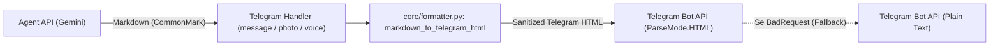

# Plano de Implementação: Correção e Formatação Markdown no Telegram Bot

Este documento descreve a correção do erro de parsing de Markdown no `telegram_api` e a implementação de um sistema robusto de conversão de Markdown para Telegram HTML.

---

## 1. Diagnóstico do Problema

O log do Telegram Bot registrou o seguinte erro:
```text
[WARNING] [telegram_api.handlers.message_handler] Markdown parsing failed: Can't parse entities: can't find end of the entity starting at byte offset 136
```

### Causas:
1. **Modo `ParseMode.MARKDOWN` (Legado):**
   - O bot utiliza `ParseMode.MARKDOWN` (versão 1 legada da Telegram Bot API).
   - Nessa versão, negrito é `*texto*` e itálico é `_texto_`.
   - O LLM (Gemini) gera Markdown padrão (CommonMark / GFM):
     - Negrito com duplo asterisco: `**Categoria:**`, `**Valor:** **R$ 80,00**`.
     - Identificadores com underscore (snake_case): `c6_joao`, `alimentacao_geral`.
2. **Falha de Entidade:**
   - O underscore em `c6_joao` é interpretado pelo parser do Telegram como o início de uma tag de itálico (`_joao`). Como não há outro underscore para fechar, o Telegram Server rejeita a mensagem com erro 400.
   - O uso de `**` duplo gera contagem incorreta de tags bold no Telegram v1.
3. **Fallback para Plain Text:**
   - O bot captura o erro e envia a mensagem em texto puro, fazendo com que o usuário veja os caracteres literais `**`, `_` e `-` sem nenhuma formatação.

---

## 2. Arquitetura da Solução

Em vez de usar `ParseMode.MARKDOWN` ou `ParseMode.MARKDOWN_V2` (que exige escapar quase toda pontuação do texto como `.`, `!`, `-`, `(`, `)`), a abordagem recomendada pela API do Telegram para LLMs é **`ParseMode.HTML`**.

### Vantagens do `ParseMode.HTML`:
- Caracteres como `_` (em `c6_joao`), `-` (em listas), `.`, `!`, `$` não necessitam de nenhum escape.
- Apenas `&`, `<` e `>` precisam de escape em texto livre.
- Suporte total a:
  - `<b>` / `<strong>` (negrito)
  - `<i>` / `<em>` (itálico)
  - `<code>` (código inline)
  - `<pre><code>` (blocos de código)
  - `<s>` (tachado)
  - `<a>` (links)
  - `<blockquote>` (citações)

### Fluxo da Solução:



---

## 3. Componentes a Serem Criados / Modificados

### 3.1. Novo Módulo: `telegram_api/core/formatter.py`
Função `markdown_to_telegram_html(text: str) -> str`:
1. Isola blocos de código (```` ```lang\ncode\n``` ````) e código inline (`` `code` ``) com marcadores seguros sem caracteres especiais.
2. Escapa entidades HTML inseguras (`&`, `<`, `>`) no texto livre via `html.escape(quote=False)`.
3. Converte cabeçalhos Markdown (`# Título`) para `<b>Título</b>`.
4. Converte negrito e itálico combinados (`***texto***`) para `<b><i>texto</i></b>`.
5. Converte negrito (`**texto**` e `__texto__` delimitado por bordas) para `<b>texto</b>`.
6. Converte itálico (`*texto*` e `_texto_` em bordas de palavras, preservando snake_case como `c6_joao`) para `<i>texto</i>`.
7. Converte tachado (`~~texto~~`) para `<s>texto</s>`.
8. Converte links (`[texto](url)`) para `<a href="url">texto</a>`.
9. Restaura os blocos de código com `<pre><code class="language-...">` e `<code>`.

Helper `send_agent_reply(...)`:
Centraliza o envio de respostas do agente (com suporte a imagem `image_base64`, botões `reply_markup` e fallback automático para plain text caso ocorra `BadRequest`).

### 3.2. Atualização dos Handlers
- **`telegram_api/handlers/message_handler.py`**:
  - Utilizar o formatador HTML e `ParseMode.HTML`.
  - Usar o helper de envio ou aplicar a conversão e `ParseMode.HTML`.
- **`telegram_api/handlers/photo_handler.py`**:
  - Remover imports locais no meio da função (`from telegram.error import BadRequest`, etc.).
  - Utilizar o formatador HTML com `ParseMode.HTML`.
- **`telegram_api/handlers/voice_handler.py`**:
  - Remover imports locais no meio da função.
  - Utilizar o formatador HTML com `ParseMode.HTML`.

---

## 4. Plano de Testes

1. **Testes Unitários do Formatador (`telegram_api/tests/core/test_formatter.py`)**:
   - Mensagem exata do erro (`c6_joao` com `**` e listas).
   - Negrito duplo e simples (`**negrito**`, `__negrito__`).
   - Itálico simples e preservação de snake_case (`c6_joao`, `minha_conta_bancaria`).
   - Negrito + itálico combinado (`***importante***`).
   - Código inline com operadores (`a < b & c > d`).
   - Bloco de código multilinha com linguagem (```` ```python\n...\n``` ````).
   - Links Markdown (`[Link](https://...)`).
   - Texto com caracteres HTML livres (`<script>`, `x < 10`).
   - Strings vazias ou None.

2. **Testes de Integração dos Handlers**:
   - Atualizar e executar `telegram_api/tests/handlers/test_message_handler.py`.
   - Adicionar testes cobrindo envio com `ParseMode.HTML` e comportamento de fallback.

3. **Validação de Estilo e Lint**:
   - Executar `make format` (`black`).
   - Executar `make lint` (`ruff`).
   - Executar `uv run pytest telegram_api/tests`.
