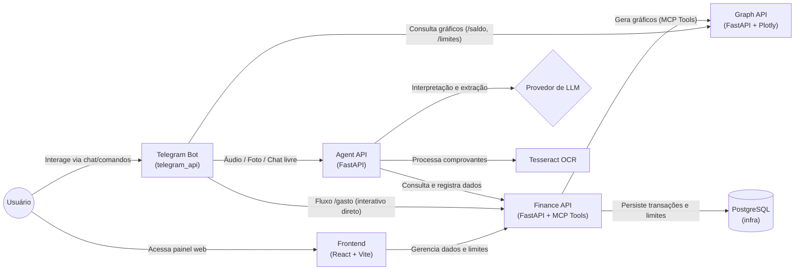

# Flauzino Assistant

> O assistente financeiro inteligente, multicanal e automatizado desenvolvido sob medida para a Família Flauzino.

---

## O que é o Flauzino?

O **Flauzino Assistant** é uma plataforma e assistente virtual desenvolvida especialmente para centralizar e simplificar a gestão financeira da **Família Flauzino**. Em vez de preencher planilhas manuais ou lidar com formulários burocráticos no dia a dia familiar, os membros da família podem registrar gastos da forma mais prática e ágil: enviando uma mensagem rápida de texto, gravando uma nota de voz no Telegram, fotografando cupons fiscais ou utilizando fluxos guiados com botões interativos.

Nos bastidores, o assistente combina modelos de linguagem avançados (LLMs) com visão computacional (OCR) para extrair informações de compras, transcrever áudios e classificar despesas automaticamente nas categorias orçamentárias da família, respeitando os limites estipulados e identificando a forma de pagamento e o dono do cartão.

Além disso, o Flauzino oferece um painel web intuitivo em React para acompanhamento visual de relatórios, faturas e parcelamentos, além de enviar gráficos periódicos de acompanhamento diretamente no chat do Telegram, garantindo transparência e controle total do orçamento familiar.

---

## Como Funciona


```mermaid
flowchart LR
    User((Usuário))
    Frontend["Frontend\n(React + Vite)"]
    Telegram["Telegram Bot\n(telegram_api)"]
    AgentAPI["Agent API\n(FastAPI)"]
    FinanceAPI["Finance API\n(FastAPI + MCP Tools)"]
    GraphAPI["Graph API\n(FastAPI + Plotly)"]
    DB[("PostgreSQL\n(infra)")]
    LLM{"Provedor de LLM"}
    OCR["Tesseract OCR"]

    User -- "Acessa painel web" --> Frontend
    User -- "Interage via chat/comandos" --> Telegram
    
    Frontend -- "Gerencia dados e limites" --> FinanceAPI
    
    Telegram -- "Fluxo /gasto (interativo direto)" --> FinanceAPI
    Telegram -- "Áudio / Foto / Chat livre" --> AgentAPI
    Telegram -- "Consulta gráficos (/saldo, /limites)" --> GraphAPI
    
    AgentAPI -- "Processa comprovantes" --> OCR
    AgentAPI -- "Interpretação e extração" --> LLM
    AgentAPI -- "Consulta e registra dados" --> FinanceAPI
    
    FinanceAPI -- "Gera gráficos (MCP Tools)" --> GraphAPI
    FinanceAPI -- "Persiste transações e limites" --> DB
```

- **`finance_api`**: Gerencia regras de negócio, persistência de despesas, orçamentos, limites de gastos e fornece MCP Tools.
- **`agent_api`**: Orquestra a inteligência conversacional via LLM e OCR para processamento de áudios, recibos e mensagens livres.
- **`graph_api`**: Microsserviço de visualização de dados com Plotly/Kaleido que gera gráficos de saldos e despesas sob demanda.
- **`telegram_api`**: Bot com fluxo guiado (`/gasto`), geração de gráficos (`/saldo`), suporte a voz/fotos e resumo semanal agendado.
- **`frontend`**: Interface Web moderna para acompanhamento em tempo real, painéis analíticos e gestão de faturas e cartões.
- **`infra`**: Orquestração via Docker Compose com PostgreSQL e inicialização automática de esquemas e dados essenciais.

---

## Quick Start

Para rodar todo o ecossistema com Docker em apenas três passos:

1. **Instale as dependências do projeto:**
   ```bash
   make install
   ```

2. **Configure o arquivo de variáveis de ambiente:**
   ```bash
   cp .env.example .env
   ```
   > 💡 O arquivo `.env.example` já inclui valores padrão para execução local. Para o setup completo, defina:
   > - `OPENAI_API_KEY`: Chave do provedor de LLM para as funções da `agent_api`.
   > - `TELEGRAM_BOT_TOKEN`: Token do bot criado no [@BotFather](https://t.me/botfather) para a `telegram_api`.
   > 
   > Para a lista completa e descrição de cada variável por serviço, consulte o [Guia de Variáveis de Ambiente](infra/README.md#guia-de-variáveis-de-ambiente-env).

3. **Inicie todos os serviços com o Docker Compose:**
   ```bash
   make docker-up
   ```

Pronto! Os serviços estarão disponíveis:
- **Painel Web:** [http://localhost:5173](http://localhost:5173)
- **Finance API Docs:** [http://localhost:8000/docs](http://localhost:8000/docs)
- **Agent API Docs:** [http://localhost:8001/docs](http://localhost:8001/docs)
- **Graph API Docs:** [http://localhost:8002/docs](http://localhost:8002/docs)

Para parar os serviços, execute `make docker-down`.

---

## Serviços e Módulos

Para detalhes técnicos, contratos de endpoints e opções específicas de cada serviço, consulte suas documentações:

| Serviço | Documentação | Descrição |
|:---|:---|:---|
| **Finance API** | [`finance_api/README.md`](finance_api/README.md) | Endpoints REST de gastos, limites, categorias e MCP tools |
| **Agent API** | [`agent_api/README.md`](agent_api/README.md) | Processamento de chat LLM, OCR de recibos e notas de voz |
| **Graph API** | [`graph_api/README.md`](graph_api/README.md) | Geração de gráficos estáticos de barras e pizza em base64 |
| **Telegram Bot** | [`telegram_api/README.md`](telegram_api/README.md) | Interface conversacional, fluxos guiados e alertas agendados |
| **Frontend** | [`frontend/README.md`](frontend/README.md) | Dashboard interativo e gestão orçamentária visual em React |
| **Infraestrutura** | [`infra/README.md`](infra/README.md) | Docker Compose, banco PostgreSQL e guia completo de variáveis |
| **Backup & Servidor** | [`infra/server/README.md`](infra/server/README.md) | Automação de backup com Rclone (OneDrive), Systemd e retenções |

---

## Backup & Resiliência

O ecossistema conta com uma rotina automatizada de backup em nuvem projetada para servidores Linux e Raspberry Pi, utilizando **Rclone** sincronizado com o **Microsoft OneDrive**:

- **PostgreSQL (`pg_dump`):** Snapshots diários compactados com retenção de **6 meses (180 dias)** localmente e na nuvem.
- **Logs das Aplicações:** Coleta diária dos logs dos containers Docker com retenção de **7 dias local** e **30 dias (1 mês) na nuvem**.
- **Proteção de Armazenamento:** Rotação de logs do Docker limitada a 30 MB por serviço e health check preventivo de disco (alerta no Telegram se uso for maior ou igual a 85%).
- **Execução Automática:** Agendamento via **Systemd Timer** diário às 03:00 e disparo preventivo no pipeline de CI/CD antes de cada deploy.

Para instruções de configuração, restauração e ativação no servidor, consulte o [Guia de Backup no Servidor](infra/server/README.md).

---

## Desenvolvimento

Comandos essenciais para desenvolvimento e manutenção do projeto:

```bash
# Executar a suíte de testes automatizados
make test

# Formatar o código automaticamente (Black + Ruff)
make format

# Executar checagens de linting e formatação
make lint
```

Para subir apenas o banco de dados durante o desenvolvimento local das APIs:
```bash
make db-up
```
