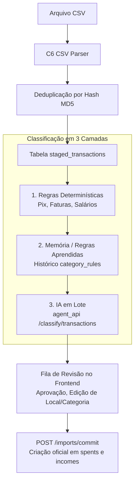

# Finance API

Interação direta com o banco de dados. A API suporta operações CRUD completas para gastos, categorias, limites e meios de pagamento.

---

## Rastreabilidade e Correlation ID (`X-Request-ID`)

A API implementa rastreabilidade distribuída através de middleware (`CorrelationIdMiddleware`):
- **Extração e Geração:** Se o cabeçalho `X-Request-ID` for enviado na requisição, ele é capturado e associado ao contexto. Se não for informado, a API gera automaticamente um UUIDv4.
- **Resposta:** O cabeçalho `X-Request-ID` é sempre retornado no cabeçalho HTTP da resposta.
- **Logs:** Todos os registros de log incluem o identificador ativo no formato `[request_id]`, permitindo correlacionar transações entre o Telegram Bot, Agent API e Finance API.

---

#### Paginação e Estrutura de Resposta

Os endpoints de listagem (`GET`) utilizam paginação baseada em página.

-   **Parâmetros de Consulta:**
    -   `page`: Número da página (padrão: `1`).
    -   `size`: Quantidade de itens por página (padrão: `10`).

-   **Estrutura da Resposta:**
    ```json
    {
      \"items\": [ ... ],
      \"total\": 50,
      \"page\": 1,
      \"size\": 10,
      \"pages\": 5
    }
    ```


#### Categories (Categorias)

Gerencie categorias de forma dinâmica via API.

- **Listar Categorias (GET /categories)**
  ```bash
  curl -X 'GET' 'http://localhost:8000/categories?page=1&size=100'
  ```

- **Obter por ID (GET /categories/{id})**
  ```bash
  curl -X 'GET' 'http://localhost:8000/categories/{category-id}'
  ```

- **Criar Categoria (POST /categories)**
  ```bash
  curl -X 'POST' 'http://localhost:8000/categories' \
    -H 'Content-Type: application/json' \
    -d '{ "key": "pets", "display_name": "Animais de Estimação" }'
  ```

- **Atualizar (PUT /categories/{id})**
  ```bash
  curl -X 'PUT' 'http://localhost:8000/categories/{category-id}' \
    -H 'Content-Type: application/json' \
    -d '{ "display_name": "Pets e Veterinário" }'
  ```

- **Deletar (DELETE /categories/{id})**
  ```bash
  curl -X 'DELETE' 'http://localhost:8000/categories/{category-id}'
  ```

> **Nota:** Após criar uma categoria, você pode usá-la imediatamente em gastos e limites usando a `key` definida.

#### Spents (Gastos)

- **Criar (POST /spents)**
  ```bash
  curl -X 'POST' 'http://localhost:8000/spents' \
    -H 'Content-Type: application/json' \
    -d '{ "category": "comer_fora", "amount": 150.50, "item_bought": "jantar", "payment_method": "itau", "payment_owner": "joao_lucas", "location": "restaurante_xyz" }'
  ```

- **Listar (GET /spents)**
  ```bash
  curl -X 'GET' 'http://localhost:8000/spents?page=1&size=10'
  ```

- **Obter por ID (GET /spents/{id})**
  ```bash
  curl -X 'GET' 'http://localhost:8000/spents/56c694c0-1c3b-4163-8d6f-76140d5e3e87'
  ```

- **Atualizar (PATCH /spents/{id})**
  ```bash
  curl -X 'PATCH' 'http://localhost:8000/spents/56c694c0-1c3b-4163-8d6f-76140d5e3e87' \
    -H 'Content-Type: application/json' \
    -d '{ "amount": 200.00 }'
  ```

- **Deletar (DELETE /spents/{id})**
  ```bash
  curl -X 'DELETE' 'http://localhost:8000/spents/56c694c0-1c3b-4163-8d6f-76140d5e3e87'
  ```

#### Limits (Limites de Gastos)

- **Criar Limite (POST /limits)**
  ```bash
  curl -X 'POST' 'http://localhost:8000/limits' \
    -H 'Content-Type: application/json' \
    -d '{ "category": "comer_fora", "amount": 2000.00 }'
  ```

- **Listar Limites (GET /limits)**
  ```bash
  curl -X 'GET' 'http://localhost:8000/limits?page=1&size=10'
  ```

- **Obter por ID (GET /limits/{id})**
  ```bash
  curl -X 'GET' 'http://localhost:8000/limits/85889a09-85dc-4969-9dea-4abc6ac4dbb8'
  ```

- **Atualizar (PATCH /limits/{id})**
  ```bash
  curl -X 'PATCH' 'http://localhost:8000/limits/85889a09-85dc-4969-9dea-4abc6ac4dbb8' \
    -H 'Content-Type: application/json' \
    -d '{ "amount": 3000.00 }'
  ```

- **Deletar (DELETE /limits/{id})**
  ```bash
  curl -X 'DELETE' 'http://localhost:8000/limits/85889a09-85dc-4969-9dea-4abc6ac4dbb8'
  ```

#### Payment Methods (Formas de Pagamento)

- **Listar (GET /payment-methods)**
  ```bash
  curl -X 'GET' 'http://localhost:8000/payment-methods?page=1&size=100'
  ```

- **Criar (POST /payment-methods)**
  ```bash
  curl -X 'POST' 'http://localhost:8000/payment-methods' \
    -H 'Content-Type: application/json' \
    -d '{ "key": "visa", "display_name": "Visa" }'
  ```

- **Atualizar (PUT /payment-methods/{id})**
  ```bash
  curl -X 'PUT' 'http://localhost:8000/payment-methods/{id}' \
    -H 'Content-Type: application/json' \
    -d '{ "display_name": "Visa Platinum" }'
  ```

- **Deletar (DELETE /payment-methods/{id})**
  ```bash
  curl -X 'DELETE' 'http://localhost:8000/payment-methods/{id}'
  ```

#### Payment Owners (Donos de Pagamento)

- **Listar (GET /payment-owners)**
  ```bash
  curl -X 'GET' 'http://localhost:8000/payment-owners?page=1&size=100'
  ```

- **Criar (POST /payment-owners)**
  ```bash
  curl -X 'POST' 'http://localhost:8000/payment-owners' \
    -H 'Content-Type: application/json' \
    -d '{ "key": "fernanda", "display_name": "Fernanda" }'
  ```

- **Atualizar (PUT /payment-owners/{id})**
  ```bash
  curl -X 'PUT' 'http://localhost:8000/payment-owners/{id}' \
    -H 'Content-Type: application/json' \
    -d '{ "display_name": "Maria Fernanda" }'
  ```

- **Deletar (DELETE /payment-owners/{id})**
  ```bash
  curl -X 'DELETE' 'http://localhost:8000/payment-owners/{id}'
  ```

---

#### Accounts (Contas Bancárias)

Gerenciamento de contas correntes, carteiras e investimentos.

- **Listar Contas (GET /accounts)**
  ```bash
  curl -X 'GET' 'http://localhost:8000/accounts/?page=1&size=100'
  ```

- **Criar Conta (POST /accounts)**
  ```bash
  curl -X 'POST' 'http://localhost:8000/accounts/' \
    -H 'Content-Type: application/json' \
    -d '{ "key": "c6_corrente", "name": "C6 Bank", "bank": "c6", "owner": "joao", "type": "CHECKING" }'
  ```

#### Credit Cards (Cartões de Crédito)

Cartões de crédito vinculados a uma conta bancária com dia de fechamento e vencimento de fatura.

- **Listar Cartões (GET /credit-cards)**
  ```bash
  curl -X 'GET' 'http://localhost:8000/credit-cards/?page=1&size=100'
  ```

- **Criar Cartão (POST /credit-cards)**
  ```bash
  curl -X 'POST' 'http://localhost:8000/credit-cards/' \
    -H 'Content-Type: application/json' \
    -d '{ "key": "c6_carbon", "name": "C6 Carbon Black", "account_id": "<uuid>", "closing_day": 2, "due_day": 10, "credit_limit": 15000.0 }'
  ```

#### Incomes (Receitas e Balanço Consolidado)

Gestão de entradas financeiras (salários, rendimentos, prêmios) e balanço consolidado de receitas vs. despesas.

- **Listar Receitas (GET /incomes)**
  ```bash
  curl -X 'GET' 'http://localhost:8000/incomes/?page=1&size=50&start_date=2026-08-01&end_date=2026-10-31'
  ```

- **Criar Receita (POST /incomes)**
  ```bash
  curl -X 'POST' 'http://localhost:8000/incomes/' \
    -H 'Content-Type: application/json' \
    -d '{ "description": "Salário Mensal", "amount": 6500.00, "category": "salario", "payment_method": "c6_joao" }'
  ```

- **Balanço Consolidado / Resumo (GET /incomes/summary)**
  Suporta consulta por mês de referência (`reference_month=YYYY-MM`) ou por período arbitrário (`start_date` e `end_date`):
  ```bash
  curl -X 'GET' 'http://localhost:8000/incomes/summary?start_date=2026-01-01&end_date=2026-10-04'
  ```

#### Imports & Staging (Importação de Extratos Bancários)

Esteira de importação e validação de extratos bancários (arquivos CSV do C6 Bank) com classificação em 3 camadas e esteira de revisão humana:



- **Fazer Upload de Extrato (POST /imports/)**
  Recebe o arquivo `.csv` e a conta bancária de destino (`account_id`), processando o parsing e aplicando a classificação em lote:
  ```bash
  curl -X 'POST' 'http://localhost:8000/imports/' \
    -F 'account_id=<uuid>' \
    -F 'file=@/path/to/extrato_c6.csv'
  ```

- **Listar Transações em Staging (GET /imports/transactions)**
  Permite filtrar por status (`PENDING`, `APPROVED`, `COMMITTED`, `IGNORED`), lote, tipo ou suspeitas de duplicata:
  ```bash
  curl -X 'GET' 'http://localhost:8000/imports/transactions?status=PENDING&page=1&size=50'
  ```

- **Atualizar Transação (PATCH /imports/transactions/{id})**
  Permite ajustar categoria, tipo (`EXPENSE`, `INCOME`, `TRANSFER`, `INVOICE_PAYMENT`, `REFUND`), local e status:
  ```bash
  curl -X 'PATCH' 'http://localhost:8000/imports/transactions/{id}' \
    -H 'Content-Type: application/json' \
    -d '{ "category": "alimentacao", "location": "Uberlândia", "status": "APPROVED", "remember": true }'
  ```

- **Efetivar Transações Aprovadas (POST /imports/commit)**
  Oficializa as transações aprovadas gerando lançamentos reais em `spents` (despesas) e `incomes` (receitas):
  ```bash
  curl -X 'POST' 'http://localhost:8000/imports/commit' \
    -H 'Content-Type: application/json' \
    -d '{ "batch_id": "<uuid-opcional>" }'
  ```
